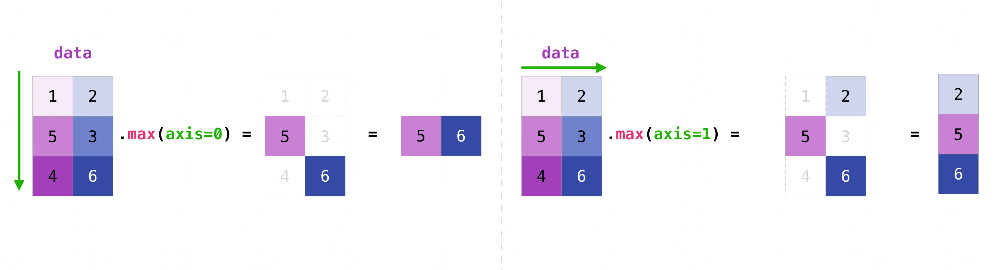

# NumPy: 绝对基础入门指南

欢迎来到NumPy绝对初学者指南！

NumPy（**Num**erical **Py**thon）是一个广泛应用于科学和工程领域的开源Python库。NumPy库包含了多维数组数据结构，如同类的N维`ndarray`，以及一套在此类数据结构上高效操作的大型函数库。欲了解更多关于NumPy的信息，请访问[什么是NumPy](https://numpy.org/devdocs/user/whatisnumpy.html)，如有评论或建议，请[联系我们](https://numpy.org/community/)！

## 如何导入NumPy

安装NumPy后，可以通过以下方式将其导入Python代码中：

```python
import numpy as np
```

这一广泛应用的约定允许通过简短且易于识别的前缀（`np.`）访问NumPy特性，同时区分NumPy特性与同名的其他特性。

## 阅读示例代码

在NumPy文档中，你会看到如下形式的代码块：

```python
>>> a = np.array([[1, 2, 3],
...               [4, 5, 6]])
>>> a.shape
(2, 3)
```

由`>>>`或`...`引导的文本是**输入**，即你在脚本中或Python提示符下输入的代码。其余部分是**输出**，即运行你的代码后得到的结果。请注意，`>>>`和`...`并非代码的一部分，如果在Python提示符下输入可能会引发错误。

## 为何使用NumPy？

Python列表是非常优秀的通用容器。它们可以是“异构”的，意味着可以包含多种类型的元素，并且当对少量元素执行个别操作时速度相当快。

根据数据的特性和需要执行的操作类型，其他容器可能更为合适；通过利用这些特性，我们可以提高速度、减少内存消耗，并为执行各种常见处理任务提供高级语法。当有大量的“同质”（同一类型）数据需要在CPU上处理时，NumPy大放异彩。

## 什么是“数组”？

在计算机编程中，数组是一种用于存储和检索数据的结构。我们常把数组想象成一个空间中的网格，每个单元格子存储数据的一个元素。例如，如果数据的每个元素都是数字，我们可能会将一维数组形象化为一个列表：

$$\begin{aligned}
\begin{array}{|c|c|c|c|}
\hline
1 & 5 & 2 & 0 \\
\hline
\end{array}
\end{aligned}$$

二维数组就像一张表格：

$$\begin{aligned}
\begin{array}{|c|c|c|c|}
\hline
1 & 5 & 2 & 0 \\
\hline
8 & 3 & 6 & 1 \\
\hline
1 & 7 & 2 & 9 \\
\hline
\end{array}
\end{aligned}$$

三维数组则像是一组表格，也许像是印在不同页面上的堆叠起来一样。在NumPy中，这个概念被泛化到任意数量的维度，因此基本的数组类被称为`ndarray`：它代表了一个“N维数组”。

大多数NumPy数组都有一定的限制。例如：

- 数组内的所有元素必须是相同类型的数据。
- 创建后，数组的总大小不能改变。
- 形必须是“矩形”，而不是“锯齿状”；例如，二维数组的每一行必须有相同数量的列。

当满足这些条件时，NumPy利用这些特性使数组比其他限制较少的数据结构更快、内存效率更高且使用更方便。

在本文档剩余部分，我们将使用“数组”一词来指代指`ndarray`的实例。

## 数组基础

初始化数组的一种方法是使用Python序列，如列表。例如：

```python
>>> a = np.array([1, 2, 3, 4, 5, 6])
>>> a
array([1, 2, 3, 4, 5, 6])
```

数组的元素可以通过[多种方式](https://numpy.org/devdocs/user/quickstart.html#quickstart-indexing-slicing-and-iterating)进行访问。例如，我们可以像访问原始列表中的元素一样访问这个数组中的单个元素：使用方括号内的元素的整数索引。

```python
>>> a[0]
1
```

> 与内置Python序列一样，NumPy数组是“0索引”的：数组的第一个元素使用索引`0`访问，而不是`1`。

与原始列表一样，数组是可变的。

```python
>>> a[0] = 10
>>> a
array([10,  2,  3,  4,  5,  6])
```

与原始列表类似，Python的切片表示法也可以用于索引。

```python
>>> a[:3]
array([10, 2, 3])
```

一个主要区别是，列表的切片索引会将元素复制到一个新列表中，但数组的切片返回一个*视图*：一个指向原始数组中数据的对象。原始数组可以通过这个视图进行变更。

```python
>>> b = a[3:]
>>> b
array([4, 5, 6])
>>> b[0] = 40
>>> a
array([ 10,  2,  3, 40,  5,  6])
```

请查看[Copies and views](https://numpy.org/devdocs/user/basics.copies.html#basics-copies-and-views)以获取关于数组操作何时返回视图而非副本的更全面解释。

二维及更高维度的数组可以从嵌套的Python序列初始化：

```python
>>> a = np.array([[1, 2, 3, 4], [5, 6, 7, 8], [9, 10, 11, 12]])
>>> a
array([[ 1,  2,  3,  4],
       [ 5,  6,  7,  8],
       [ 9, 10, 11, 12]])
```

在NumPy中，数组的维度有时被称为“轴”。这种术语可能有助于区分数组的维度和数组所表示的数据的维度。例如，数组`a`可能表示三个点，每个点都位于一个四维空间中，但`a`只有两个“轴”。

数组与列表的列表之间的另一个区别是，可以通过在单个方括号内指定每个轴的索引（以逗号分隔）来访问数组的元素。例如，元素`8`位于第`1`行和第`3`列：

```python
>>> a[1, 3]
8
```

在数学中，通常先通过行索引再通过列索引来引用矩阵的元素。这对于二维数组也适用，但更好的心理模型是将列索引视为*最后*一个，行索引视为*倒数第二个*。这种思维可以推广到具有*任何*数量的维度的数组。

你可能会听到0维（零维）数组被称为“标量”，1维（一维）数组被称为“向量”，2维（二维）数组被称为“矩阵”，或者N维（N维，其中“N”通常是大于2的整数）数组被称为“张量”。为了清晰起见，在引用数组时最好避免使用这些数学术语，因为这些名称所代表的数学对象的行为与数组不同（例如，“矩阵”乘法与“数组”乘法在本质上是不同的），而且科学Python生态系统中还有其他具有这些名称的对象（例如，PyTorch的基本数据结构就是“张量”）。

## 数组属性

*本节介绍了数组的* `ndim`、`shape`、`size` *和* `dtype` *属性*。

------------------------------------------------------------------------

数组的维度数量包含在 `ndim` 属性中。

```python
>>> a.ndim
2
```

数组的形状是一个非负整数的元组，它指定了每个维度上的元素数量。

```python
>>> a.shape
(3, 4)
>>> len(a.shape) == a.ndim
True
```

数组中固定的、总的元素数量包含在 `size` 属性中。

```python
>>> a.size
12
>>> import math
>>> a.size == math.prod(a.shape)
True
```

数组通常是“同质的”，这意味着它们只包含一种“数据类型”的元素。数据类型记录在 `dtype` 属性中。

```python
>>> a.dtype
dtype('int64')  # "int" 代表整数，"64" 代表 64 位
```

[在这里了解更多关于数组属性的信息](https://numpy.org/devdocs/reference/arrays.ndarray.html#arrays-ndarray) 并学习[关于数组对象的更多内容](https://numpy.org/devdocs/reference/arrays.html#arrays)。

## 如何创建基础数组

*本节介绍了* `np.zeros()`、`np.ones()`、`np.empty()`、`np.arange()`、`np.linspace()`

------------------------------------------------------------------------

除了从元素序列中创建数组外，你还可以轻松地创建一个填充了`0`的数组：

```python
>>> np.zeros(2)
array([0., 0.])
```

或者一个填充了`1`的数组：

```python
>>> np.ones(2)
array([1., 1.])
```

甚至是一个空数组！`empty`函数会创建一个初始内容为随机的数组，这取决于内存的状态。使用`empty`而不是`zeros`（或类似函数）的原因是速度——只需确保之后填充每个元素即可！

```python
>>> # 创建一个包含2个元素的空数组
>>> np.empty(2) #doctest: +SKIP
array([3.14, 42.  ])  # 内容可能不同
```

你可以创建一个包含一系列元素的数组：

```python
>>> np.arange(4)
array([0, 1, 2, 3])
```

你甚至可以创建一个包含一系列等间隔区间的数组。为此，你需要指定**起始数字**、**结束数字**和**步长**。

```python
>>> np.arange(2, 9, 2)
array([2, 4, 6, 8])
```

你还可以使用`np.linspace()`来创建一个在指定区间内线性分布的值的数组：

```python
>>> np.linspace(0, 10, num=5)
array([ 0. ,  2.5,  5. ,  7.5, 10. ])
```

**指定你的数据类型**

虽然默认的数据类型是浮点数（`np.float64`），但你可以使用`dtype`关键字明确指定你想要的数据类型。

```python
>>> x = np.ones(2, dtype=np.int64)
>>> x
array([1, 1])
```

[在这里了解更多关于创建数组的信息](https://numpy.org/devdocs/user/quickstart.html#quickstart-array-creation)

## 添加、删除和排序元素

*本节涵盖了* `np.sort()`、`np.concatenate()`

------------------------------------------------------------------------

使用`np.sort()`可以简单地排序数组。在调用函数时，你可以指定轴、排序方式和排序顺序。

如果你从以下数组开始：

```python
>>> arr = np.array([2, 1, 5, 3, 7, 4, 6, 8])
```

你可以快速地将数字按升序排序：

```python
>>> np.sort(arr)
array([1, 2, 3, 4, 5, 6, 7, 8])
```

除了返回数组的排序副本的`sort`外，你还可以使用：

-   [`argsort`](https://numpy.org/devdocs/reference/generated/numpy.argsort.html#numpy.argsort)，它沿着指定轴进行间接排序，
-   [`lexsort`](https://numpy.org/devdocs/reference/generated/numpy.lexsort.html#numpy.lexsort)，它基于多个键进行稳定的间接排序，
-   [`searchsorted`](https://numpy.org/devdocs/reference/generated/numpy.searchsorted.html#numpy.searchsorted)，它会在已排序的数组中找到元素，
-   [`partition`](https://numpy.org/devdocs/reference/generated/numpy.partition.html#numpy.partition)，它执行部分排序。

要了解更多关于数组排序的信息，请参阅：[`sort`](https://numpy.org/devdocs/reference/generated/numpy.sort.html#numpy.sort)。

如果你从以下数组开始：

```python
>>> a = np.array([1, 2, 3, 4])
>>> b = np.array([5, 6, 7, 8])
```

你可以使用`np.concatenate()`将它们连接起来：

```python
>>> np.concatenate((a, b))
array([1, 2, 3, 4, 5, 6, 7, 8])
```

或者，如果你从以下数组开始：

```python
>>> x = np.array([[1, 2], [3, 4]])
>>> y = np.array([[5, 6]])
```

你可以使用以下方式将它们连接起来：

```python
>>> np.concatenate((x, y), axis=0)
array([[1, 2],
       [3, 4],
       [5, 6]])
```

要从数组中删除元素，简单地使用索引来选择你想要保留的元素即可。

要了解更多关于`concatenate`的信息，请参阅：[`concatenate`](https://numpy.org/devdocs/reference/generated/numpy.concatenate.html#numpy.concatenate)。

## 如何知道数组的形状和大小？

*本节涵盖* `ndarray.ndim`，`ndarray.size`，`ndarray.shape`

------------------------------------------------------------------------

`ndarray.ndim` 将告诉你数组的轴或维度的数量。

`ndarray.size` 将告诉你数组的总元素数量。这是数组形状中元素的乘积。

`ndarray.shape` 将显示一个整数元组，表示沿数组的每个维度存储的元素数量。例如，如果你有一个2-D数组，它有2行和3列，那么你的数组的形状就是 `(2, 3)`。

例如，如果你创建了这个数组：

```python
>>> array_example = np.array([[[0, 1, 2, 3],
...                            [4, 5, 6, 7]],
...
...                           [[0, 1, 2, 3],
...                            [4, 5, 6, 7]],
...
...                           [[0, 1, 2, 3],
...                            [4, 5, 6, 7]]])
```

要查找数组的维度数量，请运行：

```python
>>> array_example.ndim
3
```

要查找数组中的总元素数量，请运行：

```python
>>> array_example.size
24
```

而要查找你的数组的形状，请运行：

```python
>>> array_example.shape
(3, 2, 4)
```

## 可以重塑数组的形状吗？

*本节涵盖* `arr.reshape()`

------------------------------------------------------------------------

**可以！**

使用 `arr.reshape()` 可以为数组赋予新的形状，同时不改变数据。只需要记住，当你使用重塑方法时，你希望产生的数组需要具有与原始数组相同数量的元素。如果你从一个包含12个元素的数组开始，你需要确保你的新数组也总共有12个元素。

如果你从以下数组开始：

```python
>>> a = np.arange(6)
>>> print(a)
[0 1 2 3 4 5]
```

你可以使用 `reshape()` 来重塑你的数组。例如，你可以将这个数组重塑为一个有三行两列的数组：

```python
>>> b = a.reshape(3, 2)
>>> print(b)
[[0 1]
 [2 3]
 [4 5]]
```

使用 `np.reshape`，你可以指定一些可选参数：

```python
>>> np.reshape(a, shape=(1, 6), order='C')
array([[0, 1, 2, 3, 4, 5]])
```

`a` 是要被重塑的数组。

`newshape` 是你想要的新形状。你可以指定一个整数或一个整数元组。如果你指定一个整数，结果将是一个具有该长度的数组。这个形状应该与原始形状兼容。

`order:` `C` 意味着使用类似C的索引顺序来读取/写入元素，`F` 意味着使用类似Fortran的索引顺序来读取/写入元素，`A` 意味着如果`a`在内存中是Fortran连续的，则使用类似Fortran的索引顺序读取/写入元素，否则使用类似C的索引顺序。（这是一个可选参数，不需要指定。）

如果你想了解更多关于C和Fortran顺序的信息，你可以[在这里阅读更多关于NumPy数组内部组织的内容](https://numpy.org/devdocs/dev/internals.html#numpy-internals)。基本上，C和Fortran顺序与索引如何对应数组在内存中的存储顺序有关。在Fortran中，当遍历二维数组的元素时，这些元素按其在内存中的存储顺序移动，**第一个**索引是最快变化的索引。随着第一个索引移动到下一行时，矩阵是逐列存储的。这就是为什么Fortran被认为是**列优先语言**。另一方面，在C中，**最后一个**索引变化得最快。矩阵是按行存储的，使其成为**行优先语言**。你选择C还是Fortran取决于是否更重要地保留索引约定还是重新排序数据。

[在这里了解更多关于形状操作的信息](https://numpy.org/devdocs/user/quickstart.html#quickstart-shape-manipulation)

## 如何将1D数组转换为2D数组（如何给数组添加新轴）

*本节涵盖* `np.newaxis`，`np.expand_dims`

------------------------------------------------------------------------

你可以使用`np.newaxis`和`np.expand_dims`来增加现有数组的维度。

使用`np.newaxis`一次会增加数组的一个维度。这意味着**1D**数组将变成**2D**数组，**2D**数组将变成**3D**数组，以此类推。

例如，如果你从以下数组开始：

```python
>>> a = np.array([1, 2, 3, 4, 5, 6])
>>> a.shape
(6,)
```

你可以使用`np.newaxis`来添加一个新轴：

```python
>>> a2 = a[np.newaxis, :]
>>> a2.shape
(1, 6)
```

你可以使用`np.newaxis`明确地将1D数组转换为行向量或列向量。例如，你可以通过在第一个维度上插入一个轴来将1D数组转换为行向量：

```python
>>> row_vector = a[np.newaxis, :]
>>> row_vector.shape
(1, 6)
```

或者，如果你想得到一个列向量，你可以在第二个维度上插入一个轴：

```python
>>> col_vector = a[:, np.newaxis]
>>> col_vector.shape
(6, 1)
```

你还可以使用`np.expand_dims`在指定位置插入一个新轴来扩展数组。

例如，如果你从以下数组开始：

```python
>>> a = np.array([1, 2, 3, 4, 5, 6])
>>> a.shape
(6,)
```

你可以使用`np.expand_dims`在索引位置1处添加一个轴，如下：

```python
>>> b = np.expand_dims(a, axis=1)
>>> b.shape
(6, 1)
```

你可以在索引位置0处添加一个轴，如下：

```python
>>> c = np.expand_dims(a, axis=0)
>>> c.shape
(1, 6)
```

在[这里](https://numpy.org/devdocs/reference/routines.indexing.html#arrays-indexing)了解更多关于`newaxis`的信息，在[expand_dims](https://numpy.org/devdocs/reference/generated/numpy.expand_dims.html#numpy.expand_dims)页面了解更多关于`expand_dims`的信息。

## 索引和切片

你可以以与在Python列表中切片相同的方式对NumPy数组进行索引和切片。例如：

```python
>>> data = np.array([1, 2, 3])

>>> data[1]
2
>>> data[0:2]
array([1, 2])
>>> data[1:]
array([2, 3])
>>> data[-2:]
array([2, 3])
```

可以这样形象地理解：


你可能想要从数组中取出一个部分或特定的数组元素以进行进一步的分析或额外的操作。为此，你需要对数组进行子集划分、切片和/或索引。

如果你想从数组中选择满足某些条件的值，使用NumPy会很简单。

例如，如果你从以下数组开始：

```python
>>> a = np.array([[1, 2, 3, 4], [5, 6, 7, 8], [9, 10, 11, 12]])
```

你可以轻松地打印出数组中所有小于5的值：

```python
>>> print(a[a < 5])
[1 2 3 4]
```

你还可以选择，例如，大于或等于5的数字，并使用这个条件对数组进行索引：

```python
>>> five_up = (a >= 5)
>>> print(a[five_up])
[ 5  6  7  8  9 10 11 12]
```

你可以选择能被2整除的元素：

```python
>>> divisible_by_2 = a[a%2==0]
>>> print(divisible_by_2)
[ 2  4  6  8 10 12]
```

或者，你可以使用`&`（与）和`|`（或）运算符来选择满足两个条件的元素：

```python
>>> c = a[(a > 2) & (a < 11)]
>>> print(c)
[ 3  4  5  6  7  8  9 10]
```

你还可以使用逻辑运算符**&**和**|**来获取布尔值，这些布尔值指定了数组中的值是否满足某个条件。这对于包含名称或其他分类值的数组非常有用。例如：

```python
>>> five_up = (a > 5) | (a == 5)
>>> print(five_up)
[[False False False False]
 [ True  True  True  True]
 [ True  True  True  True]]
```

你还可以使用`np.nonzero()`从数组中选择元素或索引。

从以下数组开始：

```python
>>> a = np.array([[1, 2, 3, 4], [5, 6, 7, 8], [9, 10, 11, 12]])
```

你可以使用`np.nonzero()`来打印例如小于5的元素的索引：

```python
>>> b = np.nonzero(a < 5)
>>> print(b)
(array([0, 0, 0, 0]), array([0, 1, 2, 3]))
```

这里`b`是一个包含两个数组的元组，分别表示行索引和列索引。在这个例子中，`b[0]`包含了所有小于5的元素的行索引，而`b[1]`包含了相应的列索引。

在这个例子中，返回了一个数组元组：每个维度一个。第一个数组表示找到这些值的行索引，第二个数组表示找到这些值的列索引。

如果你想要生成元素存在的坐标列表，你可以将这两个数组进行`zip`操作，然后遍历坐标列表并打印它们。例如：

```python
>>> list_of_coordinates = list(zip(b[0], b[1]))

>>> for coord in list_of_coordinates:
...     print(coord)
(0, 0)
(0, 1)
(0, 2)
(0, 3)
```

你也可以使用`np.nonzero()`来打印数组中所有小于5的元素，如下：

```python
>>> print(a[b])
[1 2 3 4]
```

如果你正在查找的元素在数组中不存在，那么返回的索引数组将是空的。例如：

```python
>>> not_there = np.nonzero(a == 42)
>>> print(not_there)
(array([], dtype=int64), array([], dtype=int64))
```

要了解更多关于[索引和切片](https://numpy.org/devdocs/user/quickstart.html#quickstart-indexing-slicing-and-iterating)以及[基础索引](https://numpy.org/devdocs/user/basics.indexing.html#basics-indexing)的信息，请访问这些链接。

更多关于使用`nonzero`函数的信息，请查阅：[`nonzero`](https://numpy.org/devdocs/reference/generated/numpy.nonzero.html#numpy.nonzero)。

## 如何从现有数据创建数组

*本节涵盖* `切片和索引`、`np.vstack()`、`np.hstack()`、`np.hsplit()`、`.view()`、`copy()`

------------------------------------------------------------------------

你可以很容易地从现有数组的一个部分创建一个新数组。

假设你有以下数组：

```python
>>> a = np.array([1,  2,  3,  4,  5,  6,  7,  8,  9, 10])
```

你可以通过指定你想要切片的数组的位置，随时从数组的一个部分创建一个新数组。例如：

```python
>>> arr1 = a[3:8]
>>> arr1
array([4, 5, 6, 7, 8])
```

在这里，你从索引位置3到索引位置8（不包括8）获取了数组的一部分。

你也可以将两个现有的数组垂直和水平堆叠。假设你有两个数组，`a1`和`a2`：

```python
>>> a1 = np.array([[1, 1],
...                [2, 2]])

>>> a2 = np.array([[3, 3],
...                [4, 4]])
```

你可以使用`vstack`将它们垂直堆叠：

```python
>>> np.vstack((a1, a2))
array([[1, 1],
       [2, 2],
       [3, 3],
       [4, 4]])
```
或者，你可以使用`hstack`将它们水平堆叠：

```python
>>> np.hstack((a1, a2))
array([[1, 1, 3, 3],
       [2, 2, 4, 4]])
```

你可以使用`hsplit`将一个数组拆分成几个更小的数组。你可以指定要返回的具有相同形状的数组的数量，或者指定在哪些列之后进行分割。

假设你有以下数组：

```python
>>> x = np.arange(1, 25).reshape(2, 12)
>>> x
array([[ 1,  2,  3,  4,  5,  6,  7,  8,  9, 10, 11, 12],
       [13, 14, 15, 16, 17, 18, 19, 20, 21, 22, 23, 24]])
```

如果你想把这个数组拆分成三个具有相同形状的数组，你应该运行：

```python
>>> np.hsplit(x, 3)
[array([[ 1,  2,  3,  4],
        [13, 14, 15, 16]]), array([[ 5,  6,  7,  8],
        [17, 18, 19, 20]]), array([[ 9, 10, 11, 12],
        [21, 22, 23, 24]])]
```

如果你想在第三列和第四列之后分割你的数组，你应该运行：

```python
>>> np.hsplit(x, (3, 4))
[array([[ 1,  2,  3],
        [13, 14, 15]]), array([[ 4],
        [16]]), array([[ 5,  6,  7,  8,  9, 10, 11, 12],
        [17, 18, 19, 20, 21, 22, 23, 24]])]
```

[在这里了解更多关于堆叠和拆分数组的信息](https://numpy.org/devdocs/user/quickstart.html#quickstart-stacking-arrays)。

你可以使用`view`方法来创建一个新的数组对象，这个对象与原始数组查看相同的数据（即*浅拷贝*）。

视图是NumPy中一个重要的概念！NumPy函数以及像索引和切片这样的操作，只要可能，就会返回视图。这节省了内存并且更快（不需要复制数据）。但是，了解这一点很重要——在视图中修改数据也会修改原始数组！

假设你创建了以下数组：

```python
>>> a = np.array([[1, 2, 3, 4], [5, 6, 7, 8], [9, 10, 11, 12]])
```

现在我们通过切片`a`来创建一个数组`b1`，并修改`b1`的第一个元素。这也会修改`a`中对应的元素！：

```python
>>> b1 = a[0, :]
>>> b1
array([1, 2, 3, 4])
>>> b1[0] = 99
>>> b1
array([99,  2,  3,  4])
>>> a
array([[99,  2,  3,  4],
       [ 5,  6,  7,  8],
       [ 9, 10, 11, 12]])
```

使用`copy`方法将创建数组及其数据的完整副本（即*深拷贝*）。要在你的数组上使用这个方法，你可以运行：

```python
>>> b2 = a.copy()
```

[【在这里了解更多关于拷贝和视图的信息】](https://numpy.org/devdocs/user/quickstart.html#quickstart-copies-and-views)。

## 基本数组操作

*本节涵盖加法、减法、乘法、除法等操作*

------------------------------------------------------------------------

一旦你创建了数组，就可以开始使用它们了。比如说，你已经创建了两个数组，一个叫做“data”，另一个叫做“ones”。


你可以使用加号将这两个数组相加。

```python
>>> data = np.array([1, 2])
>>> ones = np.ones(2, dtype=int)
>>> data + ones
array([2, 3])
```


当然，你可以做的不仅仅是加法！

```python
>>> data - ones
array([0, 1])
>>> data * data
array([1, 4])
>>> data / data
array([1., 1.])
```


使用NumPy进行基本操作非常简单。如果你想找到数组中所有元素的和，你会使用`sum()`函数。这适用于一维数组、二维数组以及更高维度的数组。

```python
>>> a = np.array([1, 2, 3, 4])

>>> a.sum()
10
```

要在二维数组中对行或列进行求和，你需要指定轴（axis）。

如果你从以下数组开始：

```python
>>> b = np.array([[1, 1], [2, 2]])
```

你可以对行轴进行求和：

```python
>>> b.sum(axis=0)
array([3, 3])
```

你也可以对列轴进行求和：

```python
>>> b.sum(axis=1)
array([2, 4])
```

[在此处了解更多关于基本操作的信息](https://numpy.org/devdocs/user/quickstart.html#quickstart-basic-operations)。

## 广播机制

有时候，你可能希望在一个数组和一个单独的数字（也称为*向量和标量之间的操作*）或两个不同大小的数组之间进行某种操作。例如，你的数组（我们称之为“data”）可能包含以英里为单位的距离信息，但你想将这些信息转换为公里。你可以使用以下操作来实现这一点：

```python
>>> data = np.array([1.0, 2.0])
>>> data * 1.6
array([1.6, 3.2])
```


NumPy 明白乘法应该与每个单元格进行。这个概念叫做**广播机制**。广播机制是一种允许 NumPy 在不同形状的数组上执行操作的机制。你的数组的维度必须是兼容的，例如，当两个数组的维度相等时，或者当其中一个维度为 1 时。如果维度不兼容，你将得到一个 `ValueError`。

[在此处了解更多关于广播机制的信息](https://numpy.org/devdocs/user/basics.broadcasting.html#basics-broadcasting)。

## 更多有用的数组操作

*本节涵盖最大值、最小值、求和、平均值、乘积、标准差等*

------------------------------------------------------------------------

NumPy 还执行聚合函数。除了 `min`、`max` 和 `sum`，你还可以轻松地使用 `mean` 来获取平均值，`prod` 来获取元素相乘的结果，`std` 来获取标准差等。:

```python
>>> data.max()
2.0
>>> data.min()
1.0
>>> data.sum()
3.0
```


让我们从名为 "a" 的这个数组开始：

```python
>>> a = np.array([[0.45053314, 0.17296777, 0.34376245, 0.5510652],
...               [0.54627315, 0.05093587, 0.40067661, 0.55645993],
...               [0.12697628, 0.82485143, 0.26590556, 0.56917101]])
```

通常，你可能想要沿着行或列进行聚合。默认情况下，每个 NumPy 聚合函数都将返回整个数组的聚合结果。要查找数组中元素的总和或最小值，请运行：

```python
>>> a.sum()
4.8595784
```

或者：

```python
>>> a.min()
0.05093587
```

你可以指定要在哪个轴上计算聚合函数。例如，你可以通过指定 `axis=0` 来找到每列中的最小值。:

```python
>>> a.min(axis=0)
array([0.12697628, 0.05093587, 0.26590556, 0.5510652 ])
```

上面列出的四个值对应于你数组中列的数量。对于一个四列的数组，你将得到四个值作为结果。

[在此处了解更多关于数组方法的信息](https://numpy.org/devdocs/reference/arrays.ndarray.html#array-ndarray-methods)。

## 创建矩阵

你可以通过传递 Python 的列表的列表来在 NumPy 中创建一个二维数组（或“矩阵”）来表示它们。:

```python
>>> data = np.array([[1, 2], [3, 4], [5, 6]])
>>> data
array([[1, 2],
       [3, 4],
       [5, 6]])
```


当你在操作矩阵时，索引和切片操作是非常有用的：

```python
>>> data[0, 1]
2
>>> data[1:3]
array([[3, 4],
       [5, 6]])
>>> data[0:2, 0]
array([1, 3])
```


你可以像聚合向量一样聚合矩阵：

```python
>>> data.max()
6
>>> data.min()
1
>>> data.sum()
21
```


你可以聚合矩阵中的所有值，并且可以使用 `axis` 参数跨列或行进行聚合。为了说明这一点，让我们看一个稍微修改过的数据集：

```python
>>> data = np.array([[1, 2], [5, 3], [4, 6]])
>>> data
array([[1, 2],
       [5, 3],
       [4, 6]])
>>> data.max(axis=0)
array([5, 6])
>>> data.max(axis=1)
array([2, 5, 6])
```



创建矩阵后，如果两个矩阵大小相同，你可以使用算术运算符对它们进行加法和乘法运算。:

```python
>>> data = np.array([[1, 2], [3, 4]])
>>> ones = np.array([[1, 1], [1, 1]])
>>> data + ones
array([[2, 3],
       [4, 5]])
```


你可以对大小不同的矩阵执行这些算术运算，但仅当其中一个矩阵只有一列或一行时。在这种情况下，NumPy 将使用其广播规则来进行运算。:

```python
>>> data = np.array([[1, 2], [3, 4], [5, 6]])
>>> ones_row = np.array([[1, 1]])
>>> data + ones_row
array([[2, 3],
       [4, 5],
       [6, 7]])
```


请注意，当 NumPy 打印 N 维数组时，最后一个轴是循环最快的，而第一个轴是最慢的。例如：

```python
>>> np.ones((4, 3, 2))
array([[[1., 1.],
        [1., 1.],
        [1., 1.]],

       [[1., 1.],
        [1., 1.],
        [1., 1.]],

       [[1., 1.],
        [1., 1.],
        [1., 1.]],

       [[1., 1.],
        [1., 1.],
        [1., 1.]]])
```

我们经常会遇到需要 NumPy 初始化数组值的情况。NumPy 提供了像 `ones()` 和 `zeros()` 这样的函数，以及 `random.Generator` 类来生成随机数。你只需要传入你希望生成的元素数量即可：

```python
>>> np.ones(3)
array([1., 1., 1.])
>>> np.zeros(3)
array([0., 0., 0.])
>>> rng = np.random.default_rng()  # 生成随机数的最简单方式
>>> rng.random(3) #doctest: +SKIP
array([0.63696169, 0.26978671, 0.04097352])
```


如果你传入一个描述矩阵维度的元组，你也可以使用 `ones()`、`zeros()` 和 `random()` 来创建一个二维数组：

```python
>>> np.ones((3, 2))
array([[1., 1.],
       [1., 1.],
       [1., 1.]])
>>> np.zeros((3, 2))
array([[0., 0.],
       [0., 0.],
       [0., 0.]])
>>> rng.random((3, 2)) #doctest: +SKIP
array([[0.01652764, 0.81327024],
       [0.91275558, 0.60663578],
       [0.72949656, 0.54362499]])  # 可能会不同
```


在 [array creation routines](https://numpy.org/devdocs/reference/routines.array-creation.html#routines-array-creation) 页面可以了解更多关于创建填充了 `0`、`1`、其他值或未初始化的数组的信息。

## 生成随机数

随机数生成在许多数值计算和机器学习算法的配置和评估中扮演着重要角色。无论是需要在人工神经网络中随机初始化权重，将数据随机分成多个集合，还是随机打乱你的数据集，能够生成随机数（实际上是可重复的伪随机数）都是至关重要的。

使用 `Generator.integers`，你可以从低值（请注意，在 NumPy 中这是包含在内的）到高值（不包含）生成随机整数。你可以设置 `endpoint=True` 使得高值也包含在内。

你可以使用以下方式生成一个 2 x 4 的数组，其中包含 0 到 4 之间的随机整数：

```python
>>> rng.integers(5, size=(2, 4)) #doctest: +SKIP
array([[2, 1, 1, 0],
       [0, 0, 0, 4]])  # 可能会不同
```

[在此处了解更多关于随机数生成的信息](https://numpy.org/devdocs/reference/random/index.html#numpyrandom)。

## 如何获取唯一项及其计数

*本节涵盖了* `np.unique()`

------------------------------------------------------------------------

你可以使用 `np.unique` 轻松地找到数组中的唯一元素。

例如，如果你从以下数组开始：

```python
>>> a = np.array([11, 11, 12, 13, 14, 15, 16, 17, 12, 13, 11, 14, 18, 19, 20])
```

你可以使用 `np.unique` 来打印你数组中的唯一值：

```python
>>> unique_values = np.unique(a)
>>> print(unique_values)
[11 12 13 14 15 16 17 18 19 20]
```

要在 NumPy 数组中获取唯一值的索引（即数组中唯一值的第一个索引位置的数组），只需在 `np.unique()` 中同时传递 `return_index` 参数和你的数组即可：

```python
>>> unique_values, indices_list = np.unique(a, return_index=True)
>>> print(indices_list)
[ 0  2  3  4  5  6  7 12 13 14]
```

你可以通过在 `np.unique()` 中传递 `return_counts` 参数和你的数组，来获取 NumPy 数组中唯一值的频率计数：

```python
>>> unique_values, occurrence_count = np.unique(a, return_counts=True)
>>> print(occurrence_count)
[3 2 2 2 1 1 1 1 1 1]
```

这也适用于二维数组！如果你从以下数组开始：

```python
>>> a_2d = np.array([[1, 2, 3, 4], [5, 6, 7, 8], [9, 10, 11, 12], [1, 2, 3, 4]])
```

你可以使用以下方式找到唯一值：

```python
>>> unique_values = np.unique(a_2d)
>>> print(unique_values)
[ 1  2  3  4  5  6  7  8  9 10 11 12]
```

如果未传递`axis`参数，你的二维数组将被展平。

如果你想要获取唯一的行或列，请确保传递`axis`参数。要查找唯一的行，请指定`axis=0`；对于列，请指定`axis=1`。例如：

```python
>>> unique_rows = np.unique(a_2d, axis=0)
>>> print(unique_rows)
[[ 1  2  3  4]
 [ 5  6  7  8]
 [ 9 10 11 12]]
```

要获取唯一的行、索引位置和出现次数，你可以使用：

```python
>>> unique_rows, indices, occurrence_count = np.unique(
...      a_2d, axis=0, return_counts=True, return_index=True)
>>> print(unique_rows)
[[ 1  2  3  4]
 [ 5  6  7  8]
 [ 9 10 11 12]]
>>> print(indices)
[0 1 2]
>>> print(occurrence_count)
[2 1 1]
```

要了解更多关于在数组中查找唯一元素的信息，请参阅[`unique`](https://numpy.org/devdocs/reference/generated/numpy.unique.html#numpy.unique)。

## 矩阵的转置和重塑

*本节涵盖* `arr.reshape()`，`arr.transpose()`，`arr.T`

------------------------------------------------------------------------

通常需要转置你的矩阵。NumPy数组有一个`T`属性，它允许你转置一个矩阵。


你也可能需要切换矩阵的维度。这通常发生在，例如，你有一个模型期望的输入形状与你的数据集不同时。这时`reshape`方法就很有用。你只需要传入你想要的新矩阵维度即可：

```python
>>> data.reshape(2, 3)
array([[1, 2, 3],
       [4, 5, 6]])
>>> data.reshape(3, 2)
array([[1, 2],
       [3, 4],
       [5, 6]])
```


你还可以使用`.transpose()`方法来根据你指定的值反转或更改数组的轴。

如果你从以下数组开始：

```python
>>> arr = np.arange(6).reshape((2, 3))
>>> arr
array([[0, 1, 2],
       [3, 4, 5]])
```

你可以使用`arr.transpose()`来转置你的数组：

```python
>>> arr.transpose()
array([[0, 3],
       [1, 4],
       [2, 5]])
```

你还可以使用`arr.T`：

```python
>>> arr.T
array([[0, 3],
       [1, 4],
       [2, 5]])
```

要了解更多关于数组的转置和重塑的信息，请查阅[`transpose`](https://numpy.org/devdocs/reference/generated/numpy.transpose.html#numpy.transpose)和[`reshape`](https://numpy.org/devdocs/reference/generated/numpy.reshape.html#numpy.reshape)。

## 如何反转数组

*本节涵盖* `np.flip()`

------------------------------------------------------------------------

NumPy的`np.flip()`函数允许你沿着某个轴翻转或反转数组的内容。当使用`np.flip()`时，指定你想要反转的数组和轴。如果你不指定轴，NumPy将沿着你输入数组的所有轴反转内容。

**反转一维数组**

如果你从这样一个一维数组开始：

```python
>>> arr = np.array([1, 2, 3, 4, 5, 6, 7, 8])
```

你可以使用以下方式反转它：

```python
>>> reversed_arr = np.flip(arr)
```

如果你想要打印你的反转数组，可以运行：

```python
>>> print('Reversed Array: ', reversed_arr)
Reversed Array:  [8 7 6 5 4 3 2 1]
```

**反转二维数组**

二维数组的工作方式与一维数组非常相似。

如果你从以下数组开始：

```python
>>> arr_2d = np.array([[1, 2, 3, 4], [5, 6, 7, 8], [9, 10, 11, 12]])
```

你可以通过以下方式反转所有行和所有列的内容：

```python
>>> reversed_arr = np.flip(arr_2d)
>>> print(reversed_arr)
[[12 11 10  9]
 [ 8  7  6  5]
 [ 4  3  2  1]]
```

你可以很容易地只反转*行*的内容，指定`axis=0`：

```python
>>> reversed_arr_rows = np.flip(arr_2d, axis=0)
>>> print(reversed_arr_rows)
[[ 9 10 11 12]
 [ 5  6  7  8]
 [ 1  2  3  4]]
```

或者只反转*列*的内容，指定`axis=1`：

```python
>>> reversed_arr_columns = np.flip(arr_2d, axis=1)
>>> print(reversed_arr_columns)
[[ 4  3  2  1]
 [ 8  7  6  5]
 [12 11 10  9]]
```

你还可以只反转一列或一行的内容。例如，你可以反转索引位置为1（第二行）的行的内容：

```python
>>> arr_2d[1] = np.flip(arr_2d[1])
>>> print(arr_2d)
[[ 1  2  3  4]
 [ 8  7  6  5]
 [ 9 10 11 12]]
```

你也可以反转索引位置为1（第二列）的列的内容：

```python
>>> arr_2d[:,1] = np.flip(arr_2d[:,1])
>>> print(arr_2d)
[[ 1 10  3  4]
 [ 8  7  6  5]
 [ 9  2 11 12]]
```

有关反转数组的更多信息，请访问[`flip`](https://numpy.org/devdocs/reference/generated/numpy.flip.html#numpy.flip)。

## 重塑和扁平化多维数组

*本节涵盖* `.flatten()`, `ravel()`

------------------------------------------------------------------------

有两种流行的方法可以扁平化数组：`.flatten()` 和 `.ravel()`。这两者之间的主要区别是，使用 `ravel()` 创建的新数组实际上是父数组的引用（即“视图”）。这意味着对新数组的任何更改也将影响父数组。由于 `ravel` 不会创建副本，因此它节省内存。

如果你从以下数组开始：

```python
>>> x = np.array([[1 , 2, 3, 4], [5, 6, 7, 8], [9, 10, 11, 12]])
```

你可以使用 `flatten` 将你的数组扁平化为一个一维数组：

```python
>>> x.flatten()
array([ 1,  2,  3,  4,  5,  6,  7,  8,  9, 10, 11, 12])
```

当你使用`flatten`时，对新数组的更改不会改变原始数组。

例如：

```python
>>> a1 = x.flatten()
>>> a1[0] = 99
>>> print(x)  # 原始数组
[[ 1  2  3  4]
 [ 5  6  7  8]
 [ 9 10 11 12]]
>>> print(a1)  # 新数组
[99  2  3  4  5  6  7  8  9 10 11 12]
```

但是，当你使用`ravel`时，对新数组所做的更改将影响原始数组。

例如：

```python
>>> a2 = x.ravel()
>>> a2[0] = 98
>>> print(x)  # 原始数组
[[98  2  3  4]
 [ 5  6  7  8]
 [ 9 10 11 12]]
>>> print(a2)  # 新数组
[98  2  3  4  5  6  7  8  9 10 11 12]
```

要了解更多关于`flatten`的信息，请访问[`ndarray.flatten`](https://numpy.org/devdocs/reference/generated/numpy.ndarray.flatten.html#numpy.ndarray.flatten)，要了解更多关于`ravel`的信息，请访问[`ravel`](https://numpy.org/devdocs/reference/generated/numpy.ravel.html#numpy.ravel)。

## 如何通过docstring获取更多信息

*本节涵盖* `help()`, `?`, `??`

------------------------------------------------------------------------

在数据科学生态系统中，Python和NumPy都是以用户为中心构建的。其中一个最好的例子就是内置的文档访问功能。每个对象都包含一个对字符串的引用，这个字符串被称为**docstring**。在大多数情况下，这个docstring包含了关于对象的快速而简洁的摘要以及如何使用它的说明。Python有一个内置的`help()`函数，可以帮助你访问这些信息。这意味着，几乎每次你需要更多信息时，都可以使用`help()`来快速找到你需要的信息。

例如：

```python
>>> help(max)
在内置模块builtins中max函数的帮助信息:

max(...)
    max(iterable, *[, default=obj, key=func]) -> value
    max(arg1, arg2, *args, *[, key=func]) -> value

    带有单个可迭代参数时，返回其最大的项。
    如果提供的可迭代对象为空，则使用仅关键字参数default指定要返回的对象。
    带有两个或更多参数时，返回最大的参数。

```

因为访问额外信息非常有用，所以IPython使用`?`字符作为访问此文档以及其他相关信息的快捷方式。IPython是一个支持多种语言的交互式计算命令外壳。[你可以在这里找到关于IPython的更多信息](https://ipython.org/)。

例如：

```ipython
In [0]: max?
max(iterable, *[, default=obj, key=func]) -> value
max(arg1, arg2, *args, *[, key=func]) -> value

当只传入一个可迭代对象时，返回其最大的项。
仅通过关键字参数default指定，如果提供的可迭代对象为空，则返回的对象。
当传入两个或更多参数时，返回最大的参数。
类型:      内置函数或方法
```

你甚至可以使用这种表示法来查看对象方法和对象本身的信息。

假设你创建了以下数组：

```python
>>> a = np.array([1, 2, 3, 4, 5, 6])
```

然后你可以获取很多有用的信息（首先是关于`a`本身的细节，接着是`a`所属实例`ndarray`的docstring）：

```ipython
In [1]: a?
类型:            ndarray
字符串形式:      [1 2 3 4 5 6]
长度:          6
文件:            ~/anaconda3/lib/python3.9/site-packages/numpy/__init__.py
Docstring:       <无docstring>
类docstring:
ndarray(shape, dtype=float, buffer=None, offset=0,
        strides=None, order=None)

数组对象表示一个多维的、同质的、固定大小的项的数组。一个关联的数据类型对象描述了数组中每个元素的格式（它的字节顺序、它在内存中占用的字节数、它是否是整数、浮点数或其他等）。

应该使用`array`、`zeros`或`empty`来构造数组（请参阅下面的“另请参阅”部分）。这里给出的参数是指用于实例化数组的底层方法（`ndarray(...)`）。

要了解更多信息，请参阅`numpy`模块并检查数组的方法和属性。

参数
------
（针对__new__方法；请参阅下面的注释）

shape : 整数元组
        创建的数组的形状。
...
```

这也适用于你自己创建的函数和其他对象。只要记得在函数中包含一个docstring，使用字符串字面量（`""" """` 或 `''' '''` 包围你的文档说明）。

例如，如果你创建了以下函数：

```python
>>> def double(a):
...   '''返回 a * 2'''
...   return a * 2
```

你可以获取关于这个函数的信息：

```ipython
In [2]: double?
签名: double(a)
文档字符串: 返回 a * 2
文件:      ~/Desktop/<ipython-input-23-b5adf20be596>
类型:      函数
```

通过读取你感兴趣对象的源代码，你可以获取更深一层的信息。使用两个问号（`??`）可以访问源代码。

例如：

```ipython
In [3]: double??
签名: double(a)
源代码:
def double(a):
    '''返回 a * 2'''
    return a * 2
文件:      ~/Desktop/<ipython-input-23-b5adf20be596>
类型:      函数
```

如果被询问的对象是用非Python语言编译的，使用`??`将返回与`?`相同的信息。你会在很多内置对象和类型中发现这一点，例如：

```ipython
In [4]: len?
签名: len(obj, /)
文档字符串: 返回容器中项目的数量。
类型:      内置函数或方法
```

和：

```ipython
In [5]: len??
签名: len(obj, /)
文档字符串: 返回容器中项目的数量。
类型:      内置函数或方法
```

有相同的输出，因为它们是用除Python以外的编程语言编译的。

## 使用数学公式工作

在数组上实现数学公式的便利性使得NumPy在科学Python社区中被广泛使用。

例如，这是均方误差公式（在处理回归的监督机器学习模型中使用的核心公式）：


在NumPy中实现这个公式既简单又直接：


这个工作之所以如此出色，是因为`predictions`和`labels`可以包含一个或一千个值。它们只需要具有相同的大小。

你可以这样理解：


在这个例子中，预测值和标签向量都包含三个值，意味着`n`的值为三。在我们进行减法运算后，向量中的值被平方。然后NumPy对这些值进行求和，你的结果就是该预测的误差值以及模型质量的评分。


## 如何保存和加载 NumPy 对象

*本节涵盖* `np.save`、`np.savez`、`np.savetxt`、`np.load`、`np.loadtxt`

------------------------------------------------------------------------

在某些时候，您可能想要将数组保存到磁盘并在不重新运行代码的情况下重新加载它们。幸运的是，NumPy 提供了多种保存和加载对象的方法。`ndarray` 对象可以使用处理常规文本文件的 `loadtxt` 和 `savetxt` 函数，以及处理带有 **.npy** 文件扩展名的 NumPy 二进制文件的 `load` 和 `save` 函数，以及处理带有 **.npz** 文件扩展名的 NumPy 文件的 `savez` 函数来保存到磁盘文件并从磁盘文件中加载。

**.npy** 和 **.npz** 文件以允许在不同架构的机器上也能正确检索数组的方式存储数据、形状、数据类型（dtype）和其他用于重建 `ndarray` 所需的信息。

如果您想存储单个 `ndarray` 对象，请使用 `np.save` 将其保存为 .npy 文件。如果您想将多个 `ndarray` 对象存储在一个文件中，请使用 `np.savez` 将其保存为 .npz 文件。您还可以使用 [`savez_compressed`](https://numpy.org/devdocs/reference/generated/numpy.savez_compressed.html#numpy.savez_compressed) 将多个数组压缩成单个 npz 格式的文件。

使用 `np.save()` 保存和加载数组非常简单。只需确保指定要保存的数组和文件名即可。例如，如果您创建了这个数组：

```python
>>> a = np.array([1, 2, 3, 4, 5, 6])
```

您可以使用以下命令将其保存为 "filename.npy"：

```python
>>> np.save('filename', a)
```

您可以使用 `np.load()` 来重新构造您的数组：

```python
>>> b = np.load('filename.npy')
```

如果您想检查您的数组，可以运行：

```python
>>> print(b)
[1 2 3 4 5 6]
```

您可以使用`np.savetxt`将NumPy数组保存为纯文本文件，如**.csv**或**.txt**文件。

例如，如果您创建了以下数组：

```python
>>> csv_arr = np.array([1, 2, 3, 4, 5, 6, 7, 8])
```

您可以轻松地将其保存为名为“new_file.csv”的.csv文件，如下所示：

```python
>>> np.savetxt('new_file.csv', csv_arr)
```

您可以使用`loadtxt()`快速轻松地加载保存的文本文件：

```python
>>> np.loadtxt('new_file.csv')
array([1., 2., 3., 4., 5., 6., 7., 8.])
```

`savetxt()`和`loadtxt()`函数接受其他可选参数，如标题、页脚和分隔符。虽然文本文件更容易共享，但.npy和.npz文件更小且读取速度更快。如果您需要对文本文件进行更复杂的处理（例如，如果您需要处理包含缺失值的行），则可能需要使用[`genfromtxt`](https://numpy.org/devdocs/reference/generated/numpy.genfromtxt.html#numpy.genfromtxt)函数。

通过[`savetxt`](https://numpy.org/devdocs/reference/generated/numpy.savetxt.html#numpy.savetxt)，您可以指定标题、页脚、注释等。

点击此处了解有关[输入和输出例程的更多信息](https://numpy.org/devdocs/reference/routines.io.html#routines-io)

## 导入和导出CSV文件

读取包含现有信息的CSV文件很简单。实现这一点的最好且最简单的方法是使用[`Pandas`](https://pandas.pydata.org/)库。

```python
>>> import pandas as pd

>>> # 如果你的所有列都是同一类型：
>>> x = pd.read_csv('music.csv', header=0).values
>>> print(x)
[['Billie Holiday' 'Jazz' 1300000 27000000]
 ['Jimmie Hendrix' 'Rock' 2700000 70000000]
 ['Miles Davis' 'Jazz' 1500000 48000000]
 ['SIA' 'Pop' 2000000 74000000]]

>>> # 你也可以简单地选择你需要的列：
>>> x = pd.read_csv('music.csv', usecols=['Artist', 'Plays']).values
>>> print(x)
[['Billie Holiday' 27000000]
 ['Jimmie Hendrix' 70000000]
 ['Miles Davis' 48000000]
 ['SIA' 74000000]]
```


使用Pandas导出你的数组也很简单。如果你是NumPy的新手，你可能想要从你的数组中的值创建一个Pandas数据框，然后使用Pandas将数据框写入CSV文件。

如果你创建了这样一个数组“a”：

```python
>>> a = np.array([[-2.58289208,  0.43014843, -1.24082018, 1.59572603],
...               [ 0.99027828, 1.17150989,  0.94125714, -0.14692469],
...               [ 0.76989341,  0.81299683, -0.95068423, 0.11769564],
...               [ 0.20484034,  0.34784527,  1.96979195, 0.51992837]])
```

你可以创建一个Pandas数据框：

```python
>>> df = pd.DataFrame(a)
>>> print(df)
          0         1         2         3
0 -2.582892  0.430148 -1.240820  1.595726
1  0.990278  1.171510  0.941257 -0.146925
2  0.769893  0.812997 -0.950684  0.117696
3  0.204840  0.347845  1.969792  0.519928
```

你可以很容易地保存你的数据框：

```python
>>> df.to_csv('pd.csv')
```

并且读取CSV文件：

```python
>>> data = pd.read_csv('pd.csv')
```


你也可以使用NumPy的`savetxt`方法保存你的数组。：

```python
>>> np.savetxt('np.csv', a, fmt='%.2f', delimiter=',', header='1,  2,  3,  4')
```

如果你在使用命令行，你可以随时使用如下的命令读取保存的CSV文件：

```bash
$ cat np.csv
#  1,  2,  3,  4
-2.58,0.43,-1.24,1.60
0.99,1.17,0.94,-0.15
0.77,0.81,-0.95,0.12
0.20,0.35,1.97,0.52
```

或者你可以随时使用文本编辑器打开文件！

如果你对Pandas的学习更感兴趣，可以查阅[Pandas官方文档](https://pandas.pydata.org/index.html)。了解如何安装Pandas，请参考[Pandas官方安装指南](https://pandas.pydata.org/pandas-docs/stable/install.html)。

## 使用Matplotlib绘制数组图表

如果你需要为你的数据值生成图表，[Matplotlib](https://matplotlib.org/)可以非常简单地帮你实现。

例如，你可能有一个像这样的数组：

```python
>>> a = np.array([2, 1, 5, 7, 4, 6, 8, 14, 10, 9, 18, 20, 22])
```

如果你已经安装了Matplotlib，你可以这样导入它：

```python
>>> import matplotlib.pyplot as plt

# 如果你正在使用Jupyter Notebook，你可能还想运行以下代码行，以便在笔记本中显示你的代码：

%matplotlib inline
```

要绘制你的数据值，只需运行：

```python
>>> plt.plot(a)

# 如果你从命令行运行，可能需要执行以下操作：
# >>> plt.show()
```


例如，你可以像这样绘制一个一维数组：

```python
>>> x = np.linspace(0, 5, 20)
>>> y = np.linspace(0, 10, 20)
>>> plt.plot(x, y, 'purple') # 线条
>>> plt.plot(x, y, 'o')      # 点
```


使用Matplotlib，你可以访问大量的可视化选项。例如：

```python
>>> fig = plt.figure()
>>> ax = fig.add_subplot(projection='3d')
>>> X = np.arange(-5, 5, 0.15)
>>> Y = np.arange(-5, 5, 0.15)
>>> X, Y = np.meshgrid(X, Y)
>>> R = np.sqrt(X**2 + Y**2)
>>> Z = np.sin(R)

>>> ax.plot_surface(X, Y, Z, rstride=1, cstride=1, cmap='viridis')
```


要了解更多关于Matplotlib及其功能的信息，请查看[官方文档](https://matplotlib.org/)。关于Matplotlib的安装说明，请参阅官方的[安装部分](https://matplotlib.org/users/installing.html)。

------------------------------------------------------------------------

*图片来源：Jay Alammar https://jalammar.github.io/*