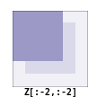
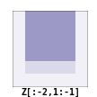
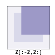
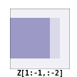
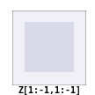
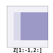
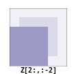
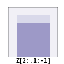
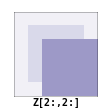
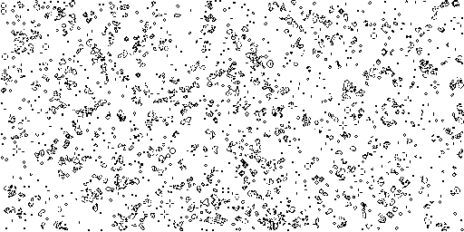

# Numpy 教程
作者：Nicolas P. Rougier

源代码可以从 [github]((https://github.com/rougier/numpy-tutorial)) 获取。

所有代码和材料均遵循 [Creative Commons Attribution-ShareAlike 4.0](https://creativecommons.org/licenses/by-sa/4.0/) 许可证。

另请参阅：
* [从 Python 到 Numpy](https://www.labri.fr/perso/nrougier/from-python-to-numpy/)
* [Matplotlib 教程](http://www.labri.fr/perso/nrougier/teaching/matplotlib/matplotlib.html)
* [100 个 Numpy 练习](http://www.labri.fr/perso/nrougier/teaching/numpy.100/index.html)

## 简介
NumPy 是 Python 中科学计算的基础包。它包含以下内容：

* → 强大的 N 维数组对象
* → 复杂的（广播）函数
* → 集成 C/C++ 和 Fortran 代码的工具
* → 有用的线性代数、傅里叶变换和随机数功能

除了其明显的科学用途外，NumPy 还可以用作通用数据的高效多维容器。可以定义任意的数据类型，这使得 NumPy 能够无缝且快速地与各种项目集成。我们将通过一个简单的例子来探索 numpy，实现“生命游戏”。

## 生命游戏
Numpy 倾向于科学计算，在这一节中，我们将考虑 John Conway 的 [生命游戏](http://en.wikipedia.org/wiki/Conway's_Game_of_Life)，这是细胞自动机最早的例子之一（见下图）。这些细胞自动机可以方便地被视为通过邻居的概念连接在一起的细胞数组。在接下来的部分中，我们将展示使用纯 Python 和 numpy 实现这个游戏的示例，以说明 Python 和 numpy 之间的主要差异。


**图 1** 生命游戏的模拟。

这是维基百科关于 [细胞自动机](http://en.wikipedia.org/wiki/Cellular_automaton) 条目的摘录。

生命游戏，也被称为“生命”，是由英国数学家 John Horton Conway 在 1970 年设计的一种细胞自动机。它是细胞自动机最著名的例子。“游戏”实际上是一个零玩家游戏，意味着其演变由初始状态决定，不需要人类玩家的输入。人们通过与生命游戏互动来创建初始配置并观察其如何演变。

生命游戏的宇宙是一个无限大的二维正交网格，由正方形细胞组成，每个细胞都处于两种可能状态之一，即存活或死亡。每个细胞都与其八个邻居进行交互，这些邻居是直接水平、垂直或对角线相邻的细胞。在每个时间步骤中，会发生以下转变：

1. 任何少于两个存活邻居的存活细胞会死亡，就像由于人口过少而需要死亡一样。
2. 任何多于三个存活邻居的存活细胞会死亡，就像由于过度拥挤而死亡一样。
3. 任何有两个或三个存活邻居的存活细胞会保持不变，进入下一代。
4. 任何有三个存活邻居的死亡细胞会变为存活细胞。

初始模式构成了系统的“种子”。第一代是通过同时应用上述规则到种子中的每个细胞来创建的——新生和死亡同时发生，这一离散时刻有时被称为“滴答”声。（换句话说，每一代都是前一代的纯函数。）这些规则将继续反复应用以创建更多代。

我们将首先使用一个非常简单的设置，更具体地说，我们将使用 [滑翔机](http://en.wikipedia.org/wiki/Glider_(Conway's_Life)) 模式，已知该模式在 4 次迭代中沿对角线移动一步，如下所示：

| | | | | |
|:-:|:-:|:-:|:-:|:-:|
|  |  |  |||
|**t = 0**|**t = 1**|**t = 2**|**t = 3**|**t = 4**|

这个特性将帮助我们调试我们的脚本。

### Python 的方式
我们本来可以使用更高效的 [python 数组接口](https://docs.python.org/3/library/array.html)，但人们可能更熟悉列表对象。

在纯 Python 中，我们可以使用列表的列表来表示棋盘，其中单元格应该进化，以此来编写“生命游戏”：

```python
>>> Z = [[0,0,0,0,0,0],
         [0,0,0,1,0,0],
         [0,1,0,1,0,0],
         [0,0,1,1,0,0],
         [0,0,0,0,0,0],
         [0,0,0,0,0,0]]
```

这个棋盘有一个 `0` 边框，允许通过避免在计算邻居数量时进行特定的边界测试来稍微加速计算。第一步是计算邻居数量：

```python
def compute_neigbours(Z):
    shape = len(Z), len(Z[0])
    N  = [[0,]*(shape[0])  for i in range(shape[1])]
    for x in range(1,shape[0]-1):
        for y in range(1,shape[1]-1):
            N[x][y] = Z[x-1][y-1]+Z[x][y-1]+Z[x+1][y-1] \
                    + Z[x-1][y]            +Z[x+1][y]   \
                    + Z[x-1][y+1]+Z[x][y+1]+Z[x+1][y+1]
    return N
```

为了随时间迭代一步，我们只需计算每个内部单元格的邻居数量，并根据四条规则更新整个棋盘：

```python
def iterate(Z):
    N = compute_neighbours(Z)
    for x in range(1,shape[0]-1):
        for y in range(1,shape[1]-1):
            if Z[x][y] == 1 and (N[x][y] < 2 or N[x][y] > 3):
                Z[x][y] = 0
            elif Z[x][y] == 0 and N[x][y] == 3:
                Z[x][y] = 1
    return Z
```

`show` 命令是与脚本一起提供的。

使用专门的显示函数，我们可以检查程序的正确性：

```python
>>> show(Z)
[0, 0, 1, 0]
[1, 0, 1, 0]
[0, 1, 1, 0]
[0, 0, 0, 0]

>>> for i in range(4): iterate(Z)
>>> show(Z)
[0, 0, 0, 0]
[0, 0, 0, 1]
[0, 1, 0, 1]
[0, 0, 1, 1]
```

你可以在这里下载完整的脚本：[game-of-life-python.py](https://github.com/rougier/numpy-tutorial/blob/master/scripts/game-of-life-python.py)

### NumPy 的方式
存在[许多不同的方式](http://docs.scipy.org/doc/numpy/reference/routines.array-creation.html)来创建 NumPy 数组。

首先要做的是创建一个合适的 NumPy 数组来存储单元格。这可以通过以下方式轻松完成：

```python
>>> import numpy as np
>>> Z = np.array([[0,0,0,0,0,0],
                  [0,0,0,1,0,0],
                  [0,1,0,1,0,0],
                  [0,0,1,1,0,0],
                  [0,0,0,0,0,0],
                  [0,0,0,0,0,0]])
```

要全面了解 NumPy 数据类型，请查阅[文档](http://docs.scipy.org/doc/numpy/reference/arrays.dtypes.html)。

请注意，我们没有指定数组的[数据类型](https://github.com/rougier/numpy-tutorial/blob/master/README.rst#data-type)，因此，NumPy 会为我们选择一个。由于所有元素都是整数，NumPy 将选择整数数据类型。这可以通过以下方式轻松检查：

```python
>>> print(Z.dtype)
int64
```

我们还可以检查数组的形状以确保它是 6x6：

```python
>>> print(Z.shape)
(6, 6)
```

可以使用行和列索引（按此顺序）来访问 Z 的每个元素：

```python
>>> print(Z[0,5])
0
```

这种元素访问实际上被称为[索引](http://docs.scipy.org/doc/numpy/reference/arrays.indexing.html)，这是向量化计算中非常强大的工具。

但更好的是，我们还可以使用切片符号来访问数组的子部分：

```python
>>> print(Z[1:5,1:5])
[[0 0 1 0]
 [1 0 1 0]
 [0 1 1 0]
 [0 0 0 0]]
```

在上面的例子中，我们实际上提取了 Z 的一个子部分，范围是从第 1 行到第 5 行和第 1 列到第 5 列。重要的是要理解，在这个意义上，这确实是 `Z` 的一个子部分，因为对这个子部分的任何更改都会立即影响 `Z`：

```python
>>> A = Z[1:5,1:5]
>>> A[0,0] = 9
>>> print(A)
[[9 0 1 0]
 [1 0 1 0]
 [0 1 1 0]
 [0 0 0 0]]

>>> print(Z)
[[0 0 0 0 0 0]
 [0 9 0 1 0 0]
 [0 1 0 1 0 0]
 [0 0 1 1 0 0]
 [0 0 0 0 0 0]
 [0 0 0 0 0 0]]
```

我们将 `A[0,0]` 的值设置为 9，并立即看到 `Z[1,1]` 的变化，因为 `A[0,0]` 实际上对应于 `Z[1,1]`。对于这样简单的数组来说，这可能看起来微不足道，但事情可能会变得更加复杂（我们稍后会看到）。如果有疑问，你可以很容易地检查一个数组是否是另一个数组的一部分：

```python
>>> print(Z.base is None)
True
>>> print(A.base is Z)
True
```

#### 计算邻居

并非总是可以对计算进行矢量化，这通常需要一些经验。你将通过使用numpy（当然）以及在[邮件列表](http://mail.scipy.org/mailman/listinfo/numpy-discussion)上提问来获得这种经验。

现在我们需要一个函数来计算邻居的数量。我们可以像Python版本那样做，但这样做会因为嵌套循环而使事情变得非常慢。我们更希望在可能的情况下对整个数组进行操作，这称为矢量化。

好的，那么让我们开始吧...

首先，你需要知道你可以像（并且仅当）它是一个常规标量那样来操作`Z`：

```python
>>> print(1+(2*Z+3))
[[4 4 4 4 4 4]
 [4 4 4 6 4 4]
 [4 6 4 6 4 4]
 [4 4 6 6 4 4]
 [4 4 4 4 4 4]
 [4 4 4 4 4 4]]
```

如果你仔细观察输出，可能会发现输出对应于上面公式对每个元素单独应用的结果。换句话说，对于任何i,j，我们有`(1+(2*Z+3))[i,j] == (1+(2*Z[i,j]+3))`。

好的，到目前为止还不错。现在如果我们将`Z`与其子部分之一相加，比如`Z[1:-1,1:-1]`，会发生什么？

```python
>>> Z + Z[1:-1,1:-1]
Traceback (most recent call last):
File "<stdin>", line 1, in <module>
ValueError: operands could not be broadcast together with shapes (6,6) (4,4)
```

这引发了一个`ValueError`，但更有趣的是，numpy抱怨无法将这两个数组一起广播。[广播](https://github.com/rougier/numpy-tutorial/blob/master/README.rst#broadcasting)是numpy的一个非常强大的特性，大多数情况下，它为你节省了很多麻烦。让我们考虑以下代码为例：

```python
>>> print(Z+1)
[[1 1 1 1 1 1]
 [1 1 1 2 1 1]
 [1 2 1 2 1 1]
 [1 1 2 2 1 1]
 [1 1 1 1 1 1]
 [1 1 1 1 1 1]]
```

请参阅numpy文档中的[广播部分](http://docs.scipy.org/doc/numpy/user/basics.broadcasting.html)。

一个矩阵和一个标量是如何相加的呢？嗯，它们不能直接相加。但是numpy足够聪明，能够猜测到你实际上是想给`Z`中的每个元素都加上1。这种广播的概念非常强大，你需要一些时间才能完全掌握它（甚至可能无法完全掌握）。

然而，在当前的情况下（如果你还记得的话，是计算邻居的数量），我们不会使用广播（嗯？）。但是我们会使用以下代码来进行矢量化计算：

```python
>>> N = np.zeros(Z.shape, dtype=int)
>>> N[1:-1,1:-1] += (Z[ :-2, :-2] + Z[ :-2,1:-1] + Z[ :-2,2:] +
                     Z[1:-1, :-2]                + Z[1:-1,2:] +
                     Z[2:  , :-2] + Z[2:  ,1:-1] + Z[2:  ,2:])
```

为了理解这段代码，请查看下面的图表：

| | | |
|:-:|:-:|:-:|
|  |  |  |
|  |  |  |
|  |  |  |

我们实际上使用上面的代码将所有深蓝色方块相加。由于我们精心选择了这些方块，所以结果将完全符合预期。如果你想自己验证一下，可以考虑中央子图中浅蓝色区域的一个单元格，并检查给定单元格的结果会是什么。

#### 迭代

注意使用 [ravel](http://docs.scipy.org/doc/numpy/reference/generated/numpy.ravel.html?highlight=ravel#numpy.ravel) 函数来展平数组。这是必要的，因为 argwhere 函数返回的是展平的索引。

在第一种方法中，我们可以使用 [argwhere](http://docs.scipy.org/doc/numpy/reference/generated/numpy.argwhere.html) 方法来编写迭代函数，该方法将给出给定条件为 True 的索引。

```python
def iterate(Z):
    # 迭代生命游戏：朴素版本
    # 计算邻居
    N = np.zeros(Z.shape, int)
    N[1:-1,1:-1] += (Z[0:-2,0:-2] + Z[0:-2,1:-1] + Z[0:-2,2:] +
                     Z[1:-1,0:-2]                + Z[1:-1,2:] +
                     Z[2:  ,0:-2] + Z[2:  ,1:-1] + Z[2:  ,2:])
    N_ = N.ravel()
    Z_ = Z.ravel()

    # 应用规则
    R1 = np.argwhere( (Z_==1) & (N_ < 2) )
    R2 = np.argwhere( (Z_==1) & (N_ > 3) )
    R3 = np.argwhere( (Z_==1) & ((N_==2) | (N_==3)) )
    R4 = np.argwhere( (Z_==0) & (N_==3) )

    # 设置新值
    Z_[R1] = 0
    Z_[R2] = 0
    Z_[R3] = Z_[R3]
    Z_[R4] = 1

    # 确保边界保持为0
    Z[0,:] = Z[-1,:] = Z[:,0] = Z[:,-1] = 0
```

即使这个版本没有使用嵌套循环，但由于使用了四个可能相当慢的argwhere调用，它仍然远非最优。相反，我们可以按以下方式利用numpy的特性。

```python
def iterate_2(Z):
    # 计算邻居
    N = (Z[0:-2,0:-2] + Z[0:-2,1:-1] + Z[0:-2,2:] +
         Z[1:-1,0:-2]                + Z[1:-1,2:] +
         Z[2:  ,0:-2] + Z[2:  ,1:-1] + Z[2:  ,2:])

    # 应用规则
    birth = (N==3) & (Z[1:-1,1:-1]==0)  # 出生条件
    survive = ((N==2) | (N==3)) & (Z[1:-1,1:-1]==1)  # 存活条件
    Z[...] = 0  # 所有Z值设为0（所有细胞变为死亡）
    Z[1:-1,1:-1][birth | survive] = 1  # 使用birth和survive数组有条件地将Z值设为1
    return Z
```

如果你查看`birth`和`survive`这两行代码，你会看到这两个变量实际上是数组。这两个表达式右边的实际上是逻辑表达式，它们会生成布尔数组（只需打印它们来检查）。然后，我们将所有`Z`值设为0（所有单元格变为死亡），并使用`birth`和`survive`数组有条件地将`Z`值设为1。这样就完成了！让我们测试一下：

```python
>>> print(Z)
[[0 0 0 0 0 0]
 [0 0 0 1 0 0]
 [0 1 0 1 0 0]
 [0 0 1 1 0 0]
 [0 0 0 0 0 0]
 [0 0 0 0 0 0]]
>>> for i in range(4): iterate_2(Z)
>>> print(Z)
[[0 0 0 0 0 0]
 [0 0 0 0 0 0]
 [0 0 0 0 1 0]
 [0 0 1 0 1 0]
 [0 0 0 1 1 0]
 [0 0 0 0 0 0]]
```

你可以在这里下载完整的脚本：[game-of-life-numpy.py](https://github.com/rougier/numpy-tutorial/blob/master/scripts/game-of-life-numpy.py)

#### 再大一点
虽然numpy在处理非常小的数组时表现完美，但当你处理大到非常大的数组时，numpy的真正优势才会体现出来。因此，让我们用更大的数组重新考虑生命游戏。首先，我们不会手动初始化数组，而是随机初始化它：

```python
>>> Z = np.random.randint(0,2,(256,512))
```

然后我们简单地像以前一样迭代：

```python
>>> for i in range(100): iterate(Z)
```

并显示结果：

```python
>>> size = np.array(Z.shape)
>>> dpi = 72.0
>>> figsize= size[1]/float(dpi),size[0]/float(dpi)
>>> fig = plt.figure(figsize=figsize, dpi=dpi, facecolor="white")
>>> fig.add_axes([0.0, 0.0, 1.0, 1.0], frameon=False)
>>> plt.imshow(Z, interpolation='nearest', cmap=plt.cm.gray_r)
>>> plt.xticks([]), plt.yticks([])
>>> plt.show()
```



很简单，不是吗？

#### 再进一步
我们已经回顾了numpy的基础知识，现在让我们转向更复杂（也更有趣）的内容。

描述来自[Gray-Scott主页](http://groups.csail.mit.edu/mac/projects/amorphous/GrayScott/)

化学物种的反应和扩散可以产生多种模式，让人联想到自然界中经常看到的那些。Gray-Scott方程模拟了这样的反应。要了解有关此化学系统的更多信息，请参阅文章《**简单系统中的复杂模式**》，作者John E. Pearson，发表于《科学》杂志，第261卷，1993年7月9日。

让我们考虑两种化学物种U和V，它们各自的浓度为u和v，扩散率分别为ru和rv。V以k的速率转化为P。f表示喂养U并消耗U、V和P的过程的速率。现在我们可以写下：

| 化学反应 | 方程 |
|:-:|:-:|
| $$U + 2V  \longrightarrow 3V$$ | $$\frac{\partial u}{\partial t} = r_u \nabla^2 u - uv^2 + f(1-u)$$ |
| $$V  \longrightarrow P$$ | $$\frac{\partial v}{\partial t} = r_v \nabla^2 v + uv^2 - (f+k)v$$ |

示例
（点击图片查看动画）

<video width="320" height="202" controls>
  <source src="movies/bacteria.mp4" type="video/mp4">
</video>

<br>

<video width="320" height="202" controls>
  <source src="movies/fingerprint.mp4" type="video/mp4">
</video>

<br>

<video width="320" height="202" controls>
  <source src="movies/zebra.mp4" type="video/mp4">
</video>

显然，你可能会认为我们需要两个数组，一个用于U，一个用于V。但由于U和V紧密相关，实际上使用单个数组可能会更好。Numpy通过[结构化数组](http://docs.scipy.org/doc/numpy/user/basics.rec.html)的概念允许我们这样做：

```python
>>> n = 200
>>> Z = np.zeros((n+2,n+2), [('U', np.double),
                             ('V', np.double)])
>>> print(Z.dtype)
[('U', '<f8'), ('V', '<f8')]
```

数组的大小是(n+2,n+2)，因为我们在计算邻居时需要边界。然而，我们只在中心部分计算微分方程，所以我们可以预先创建这个数组的一些有用的视图：

```python
>>> U,V = Z['U'], Z['V']
>>> u,v = U[1:-1,1:-1], V[1:-1,1:-1]
```

接下来，我们需要计算拉普拉斯算子，我们将使用有限差分法得到的离散近似，并使用与《生命游戏》相同的矢量化方法：

```python
def laplacian(Z):
    return (Z[0:-2,1:-1] +
            Z[1:-1,0:-2] - 4*Z[1:-1,1:-1] + Z[1:-1,2:] +
            Z[2:,1:-1])
```

最后，在选择了某些有趣的参数之后，我们可以迭代计算：

```python
for i in range(25000):
    Lu = laplacian(U)
    Lv = laplacian(V)
    uvv = u*v*v
    u += (Du*Lu - uvv + F*(1-u))
    v += (Dv*Lv + uvv - (F+k)*v)
```

大功告成！

你可以在这里下载完整的脚本：[gray-scott.py](https://github.com/rougier/numpy-tutorial/blob/master/scripts/gray-scott.py)

## 练习
以下是一些练习，尝试在不看解决方案的情况下完成它们（只需高亮显示空白部分以查看答案）。

### 初学者
1. 将numpy包导入为`np`

```python
import numpy as np
```

2. 打印numpy的版本和配置信息。

```python
print(np.__version__)
np.__config__.show()
```

3. 创建一个大小为10的零向量

```python
Z = np.zeros(10)
```

4. 创建一个大小为10的零向量，但第五个值为1

```python
Z = np.zeros(10)
Z[4] = 1
```

5. 创建一个值从10到99的向量

```python
Z = np.arange(10, 100)
```

6. 创建一个3x3的矩阵，其值从0到8

```python
Z = np.arange(9).reshape(3,3)
```

7. 找出[1,2,0,0,4,0]中非零元素的索引

```python
print(np.nonzero([1,2,0,0,4,0]))
```

8. 声明一个3x3的单位矩阵

```python
Z = np.eye(3)
```

9. 声明一个5x5的矩阵，其值1,2,3,4位于对角线下方

```python
Z = np.diag(1+np.arange(4), k=-1)  
```

10. 声明一个10x10x10的数组，其值为随机数

```python
Z = np.random.random((10,10,10))
```

### 新手

1. 声明一个8x8的矩阵并用棋盘模式填充它

```python
Z = np.zeros((8,8))
Z[1::2,::2] = 1
Z[::2,1::2] = 1
```

2. 声明一个10x10的数组并用随机数填充它，然后找出最小值和最大值

```python
Z = np.random.random((10,10))
Zmin, Zmax = Z.min(), Z.max()
```

3. 使用tile函数创建一个棋盘模式的8x8矩阵

```python
Z = np.tile( np.array([[0,1],[1,0]]), (4,4))
```

4. 将一个5x5的随机矩阵（值在0和1之间）归一化

```python
Z = np.random.random((5,5))
Zmax, Zmin = Z.max(), Z.min()
Z = (Z - Zmin) / (Zmax - Zmin)
```

5. 将一个5x3的矩阵与一个3x2的矩阵相乘（真实的矩阵乘积）

```python
Z = np.dot(np.ones((5,3)), np.ones((3,2)))
```

6. 创建一个10x10的矩阵，其行值从0到9

```python
Z = np.arange(10)[:, None]
```

7. 创建一个大小为1000的向量，其值从0到1（两者都不包括）

```python
Z = np.random.uniform(0, 1, 1000)
```

8. 创建一个大小为100的随机向量并对其进行排序

```python
Z = np.random.random(100)
Z.sort()
```

9. 考虑两个随机矩阵A和B，检查它们是否相等。

```python
A = np.random.randint(0,2,(2,2))
B = np.random.randint(0,2,(2,2))
equal = np.array_equal(A, B)
```

10. 创建一个大小为1000的随机向量并找到其平均值

```python
Z = np.random.random(1000)
m = Z.mean()
```


### 学徒

1. 考虑一个代表笛卡尔坐标的随机100x2矩阵，将其转换为极坐标

```python
Z = np.random.random((100,2))
X, Y = Z[:,0], Z[:,1]
R = np.sqrt(X**2 + Y**2)
T = np.arctan2(Y, X)
```

2. 创建一个大小为100的随机向量，并将最大值替换为0

```python
Z = np.random.random(100)
Z[Z.argmax()] = 0
```

3. 声明一个结构化数组，其中包含覆盖[0,1]x[0,1]区域的x和y坐标。

```python
Z = np.zeros((10,10), dtype=[('x',float),('y',float)])
Z['x'], Z['y'] = np.meshgrid(np.linspace(0,1,10),
                             np.linspace(0,1,10))
```

4. 打印每种numpy标量类型的最小和最大可表示值

```python
for dtype in [np.int8, np.int32, np.int64]:
    print(np.iinfo(dtype).min)
    print(np.iinfo(dtype).max)
for dtype in [np.float32, np.float64]:
    print(np.finfo(dtype).min)
    print(np.finfo(dtype).max)
    print(np.finfo(dtype).eps)
```

5. 创建一个结构化数组，表示位置(x,y)和颜色(r,g,b)

```python
Z = np.zeros(10, dtype=[('position', [('x', float, 1),
                                      ('y', float, 1)]),
                        ('color', [('r', float, 1),
                                   ('g', float, 1),
                                   ('b', float, 1)])])
```

6. 考虑一个形状为(100,2)的随机向量，表示坐标，找出逐点之间的距离

```python
# 注意：这里使用了10x2的随机矩阵作为示例，但题目中要求的是100x2
Z = np.random.random((100,2))
X, Y = Z[:,0], Z[:,1]
D = np.sqrt((X[:,None] - X)**2 + (Y[:,None] - Y)**2)
# 注意：这里使用了X[:,None]和Y[:,None]来扩展维度，以便进行逐点距离计算
```

7. 生成一个类似二维高斯分布的通用数组

```python
X, Y = np.meshgrid(np.linspace(-1,1,100), np.linspace(-1,1,100))
D = np.sqrt(X*X+Y*Y)
sigma, mu = 1.0, 0.0
G = np.exp(-( (D-mu)**2 / ( 2.0 * sigma**2 ) ) )
```

8. 考虑向量[1, 2, 3, 4, 5]，如何构建一个新向量，在每个值之间插入3个连续的零？

```python
Z = np.array([1,2,3,4,5])
nz = 3
Z0 = np.zeros(len(Z) + (len(Z)-1)*(nz))
Z0[::nz+1] = Z
```

## 超越本教程
Numpy 受益于广泛的文档支持以及庞大的用户和开发者社区。以下是一些可能有用的链接：

### 其他教程

* [SciPy 讲座笔记](http://scipy-lectures.github.io/)
  SciPy 讲座笔记提供了科学 Python 生态系统的教学材料，以及对核心工具和技术的快速介绍。不同的章节各自对应于 1 到 2 小时的课程，从初学者到专家，难度逐渐增加。
* [Numpy 急救包](http://mentat.za.net/numpy/numpy_advanced_slides/)
  Stéfan van der Walt 为数值冒险者提供的急救包。
* [Numpy 和 Scipy 入门](http://www.engr.ucsb.edu/~shell/che210d/numpy.pdf)
  M. Scott Shell 编写的 Numpy 和 Scipy 简短介绍。

### Numpy 文档

* [用户指南](http://docs.scipy.org/doc/numpy/user/)
  本指南旨在作为 NumPy 的入门概述，并解释如何安装和使用 NumPy 的最重要功能。
* [Numpy 参考手册](http://docs.scipy.org/doc/numpy/reference/index.html#reference)
  本参考手册详细说明了包含在 Numpy 中的函数、模块和对象，描述了它们的用途和功能。
* [常见问题解答（FAQ）](http://www.scipy.org/FAQ)

### 代码文档

该代码有相当完善的文档，你可以在一个 Python 会话中快速访问一个特定的命令：

```python
>>> import numpy as np
>>> help(np.ones)
在 numpy.core.numeric 模块中有关函数 ones 的帮助：

ones(shape, dtype=None, order='C')
    返回一个新的给定形状和类型的数组，用 1 填充。

    有关更多详细信息，请参阅 `zeros` 的文档。

    参见
    ----
    zeros, ones_like

    示例
    ----
    >>> np.ones(5)
    array([ 1.,  1.,  1.,  1.,  1.])

    >>> np.ones((5,), dtype=np.int)
    array([1, 1, 1, 1, 1])

    >>> np.ones((2, 1))
    array([[ 1.],
           [ 1.]])

    >>> s = (2,2)
    >>> np.ones(s)
    array([[ 1.,  1.],
           [ 1.,  1.]])
```

### 邮件列表

最后，还有一个[邮件列表](https://lists.sourceforge.net/lists/listinfo/numpy-discussion)，你可以在那里寻求帮助。

## 快速参考

### 数据类型