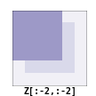
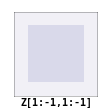
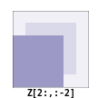
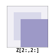

# Numpy tutorial
Writer：Nicolas P. Rougier

Sources are available from [github](https://github.com/rougier/numpy-tutorial).

All code and material is licensed under a [Creative Commons Attribution-ShareAlike 4.0](https://creativecommons.org/licenses/by-sa/4.0/).

See also:
* [From Python to Numpy](https://www.labri.fr/perso/nrougier/from-python-to-numpy/)
* [Matplotlib tutorial](http://www.labri.fr/perso/nrougier/teaching/matplotlib/matplotlib.html)
* [100 Numpy exercices](http://www.labri.fr/perso/nrougier/teaching/numpy.100/index.html)

## Introduction
NumPy is the fundamental package for scientific computing with Python. It contains among other things:

* → a powerful N-dimensional array object
* → sophisticated (broadcasting) functions
* → tools for integrating C/C++ and Fortran code
* → useful linear algebra, Fourier transform, and random number capabilities

Besides its obvious scientific uses, NumPy can also be used as an efficient multi-dimensional container of generic data. Arbitrary data-types can be defined and this allows NumPy to seamlessly and speedily integrate with a wide variety of projects. We are going to explore numpy through a simple example, implementing the Game of Life.

## The Game of Life
Numpy is slanted toward scientific computing and we'll consider in this section the [game of life](http://en.wikipedia.org/wiki/Conway's_Game_of_Life) by John Conway which is one of the earliest example of cellular automata (see figure below). Those cellular automaton can be conveniently considered as array of cells that are connected together through the notion of neighbours. We'll show in the following sections implementation of this game using pure python and numpy in order to illustrate main differences with python and numpy.


**Figure 1** Simulation of the game of life.

This is an excerpt from wikipedia entry on [Cellular Automaton](http://en.wikipedia.org/wiki/Cellular_automaton).

The Game of Life, also known simply as Life, is a cellular automaton devised by the British mathematician John Horton Conway in 1970. It is the best-known example of a cellular automaton. The "game" is actually a zero-player game, meaning that its evolution is determined by its initial state, needing no input from human players. One interacts with the Game of Life by creating an initial configuration and observing how it evolves.

The universe of the Game of Life is an infinite two-dimensional orthogonal grid of square cells, each of which is in one of two possible states, live or dead. Every cell interacts with its eight neighbours, which are the cells that are directly horizontally, vertically, or diagonally adjacent. At each step in time, the following transitions occur:

1. Any live cell with fewer than two live neighbours dies, as if by needs caused by underpopulation.
2. Any live cell with more than three live neighbours dies, as if by overcrowding.
3. Any live cell with two or three live neighbours lives, unchanged, to the next generation.
4. Any dead cell with exactly three live neighbours becomes a live cell.

The initial pattern constitutes the 'seed' of the system. The first generation is created by applying the above rules simultaneously to every cell in the seed – births and deaths happen simultaneously, and the discrete moment at which this happens is sometimes called a tick. (In other words, each generation is a pure function of the one before.) The rules continue to be applied repeatedly to create further generations.

We'll first use a very simple setup and more precisely, we'll use the [glider](http://en.wikipedia.org/wiki/Glider_(Conway's_Life)) pattern that is known to move one step diagonally in 4 iterations as illustrated below:

| | | | | |
|:-:|:-:|:-:|:-:|:-:|
|  |  |  |||
|**t = 0**|**t = 1**|**t = 2**|**t = 3**|**t = 4**|

This property will help us debug our scripts.

### The way of python
We could have used the more efficient [python array interface](https://docs.python.org/3/library/array.html) but people may be more familiar with the list object.

In pure python, we can code the Game of Life using a list of lists representing the board where cells are supposed to evolve:

```python
>>> Z = [[0,0,0,0,0,0],
         [0,0,0,1,0,0],
         [0,1,0,1,0,0],
         [0,0,1,1,0,0],
         [0,0,0,0,0,0],
         [0,0,0,0,0,0]]
```

This board possesses a `0` border that allows to accelerate things a bit by avoiding to have specific tests for borders when counting the number of neighbours. First step is to count neighbours:

```python
def compute_neigbours(Z):
    shape = len(Z), len(Z[0])
    N  = [[0,]*(shape[0])  for i in range(shape[1])]
    for x in range(1,shape[0]-1):
        for y in range(1,shape[1]-1):
            N[x][y] = Z[x-1][y-1]+Z[x][y-1]+Z[x+1][y-1] \
                    + Z[x-1][y]            +Z[x+1][y]   \
                    + Z[x-1][y+1]+Z[x][y+1]+Z[x+1][y+1]
    return N
```

To iterate one step in time, we then simply count the number of neighbours for each internal cell and we update the whole board according to the 4 rules:

```python
def iterate(Z):
    N = compute_neighbours(Z)
    for x in range(1,shape[0]-1):
        for y in range(1,shape[1]-1):
             if Z[x][y] == 1 and (N[x][y] < 2 or N[x][y] > 3):
                 Z[x][y] = 0
             elif Z[x][y] == 0 and N[x][y] == 3:
                 Z[x][y] = 1
    return Z
```

The `show` command is supplied witht he script.

Using a dedicated display function, we can check the program's correct:

```python
>>> show(Z)
[0, 0, 1, 0]
[1, 0, 1, 0]
[0, 1, 1, 0]
[0, 0, 0, 0]

>>> for i in range(4): iterate(Z)
>>> show(Z)
[0, 0, 0, 0]
[0, 0, 0, 1]
[0, 1, 0, 1]
[0, 0, 1, 1]
```

You can download the full script here: [game-of-life-python.py](https://github.com/rougier/numpy-tutorial/blob/master/scripts/game-of-life-python.py)

### The way of numpy
There exists [many more different ways](http://docs.scipy.org/doc/numpy/reference/routines.array-creation.html) to create a numpy array.

The first thing to do is to create the proper numpy array to hold the cells. This can be done very easily with:

```python
>>> import numpy as np
>>> Z = np.array([[0,0,0,0,0,0],
                  [0,0,0,1,0,0],
                  [0,1,0,1,0,0],
                  [0,0,1,1,0,0],
                  [0,0,0,0,0,0],
                  [0,0,0,0,0,0]])
```

For a complete review on numpy data types, check the [documentation](http://docs.scipy.org/doc/numpy/reference/arrays.dtypes.html).

Note that we did not specify the [data type](https://github.com/rougier/numpy-tutorial/blob/master/README.rst#data-type) of the array and thus, numpy will choose one for us. Since all elements are integers, numpy will then choose an integer data type. This can be easily checked using:

```python
>>> print(Z.dtype)
int64
```

We can also check the shape of the array to make sure it is 6x6:

```python
>>> print(Z.shape)
(6, 6)
```

Each element of Z can be accessed using a row and a column index (in that order):

```python
>>> print(Z[0,5])
0
```

This element access is actually called [indexing](http://docs.scipy.org/doc/numpy/reference/arrays.indexing.html) and this is very powerful tool for vectorized computation.

But even better, we can also access a subpart of the array using the slice notation:

```python
>>> print(Z[1:5,1:5])
[[0 0 1 0]
 [1 0 1 0]
 [0 1 1 0]
 [0 0 0 0]]
```

In the example above, we actually extract a subpart of Z ranging from rows 1 to 5 and columns 1 to 5. It is important to understand at this point that this is really a subpart of `Z` in the sense that any change to this subpart will have immediate impact on `Z`:

```python
>>> A = Z[1:5,1:5]
>>> A[0,0] = 9
>>> print(A)
[[9 0 1 0]
 [1 0 1 0]
 [0 1 1 0]
 [0 0 0 0]]

>>> print(Z)
[[0 0 0 0 0 0]
 [0 9 0 1 0 0]
 [0 1 0 1 0 0]
 [0 0 1 1 0 0]
 [0 0 0 0 0 0]
 [0 0 0 0 0 0]]
```

We set the value of `A[0,0]` to 9 and we see immediate change in `Z[1,1]` because `A[0,0]` actually corresponds to `Z[1,1]`. This may seem trivial with such simple arrays, but things can become much more complex (we'll see that later). If in doubt, you can check easily if an array is part of another one:

```python
>>> print(Z.base is None)
True
>>> print(A.base is Z)
True
```

#### Counting neighbours
It is not always possible to vectorize computations and it requires generally some experience. You'll acquire this experience by using numpy (of course) but also by asking questions on the [mailing list](http://mail.scipy.org/mailman/listinfo/numpy-discussion)

We now need a function to count the neighbours. We could do it the same way as for the python version, but this would make things very slow because of the nested loops. We would prefer to act on the whole array whenever possible, this is called vectorization.

Ok, let's start then...

First, you need to know that you can manipulate `Z` as if (and only as if) it was a regular scalar:

```python
>>> print(1+(2*Z+3))
[[4 4 4 4 4 4]
 [4 4 4 6 4 4]
 [4 6 4 6 4 4]
 [4 4 6 6 4 4]
 [4 4 4 4 4 4]
 [4 4 4 4 4 4]]
```

If you look carefully at the output, you may realize that the ouptut corresponds to the formula above applied individually to each element. Said differently, we have `(1+(2*Z+3))[i,j] == (1+(2*Z[i,j]+3))` for any i,j.

Ok, so far, so good. Now what happens if we add Z with one of its subpart, let's say `Z[1:-1,1:-1]` ?

```python
>>> Z + Z[1:-1,1:-1]
Traceback (most recent call last):
File "<stdin>", line 1, in <module>
ValueError: operands could not be broadcast together with shapes (6,6) (4,4)  
```

This raises a `Value Error`, but more interestingly, numpy complains about the impossibility of broadcasting the two arrays together. [Broadcasting](https://github.com/rougier/numpy-tutorial/blob/master/README.rst#broadcasting) is a very powerful feature of numpy and most of the time, it saves you a lot of hassle. Let's consider for example the following code:

```python
>>> print(Z+1)
[[1 1 1 1 1 1]
 [1 1 1 2 1 1]
 [1 2 1 2 1 1]
 [1 1 2 2 1 1]
 [1 1 1 1 1 1]
 [1 1 1 1 1 1]]
```

See also [the broadcasting section](http://docs.scipy.org/doc/numpy/user/basics.broadcasting.html) in the numpy documentation.

How can a matrix and a scalar be added together ? Well, they can't. But numpy is smart enough to guess that you actually want to add 1 to each of the element of `Z`. This concept of broadcasting is quite powerful and it will take you some time before masterizing it fully (if even possible).

However, in the present case (counting neighbours if you remember), we won't use broadcasting (uh ?). But we'll use vectorize computation using the following code:

```python
>>> N = np.zeros(Z.shape, dtype=int)
>>> N[1:-1,1:-1] += (Z[ :-2, :-2] + Z[ :-2,1:-1] + Z[ :-2,2:] +
                     Z[1:-1, :-2]                + Z[1:-1,2:] +
                     Z[2:  , :-2] + Z[2:  ,1:-1] + Z[2:  ,2:])
```

To understand this code, have a look at the figure below:

| | | |
|:-:|:-:|:-:|
|  |  |  |
|  |  |  |
|  |  |  |

What we actually did with the above code is to add all the darker blue squares together. Since they have been chosen carefully, the result will be exactly what we expected. If you want to convince yourself, consider a cell in the lighter blue area of the central sub-figure and check what will the result for a given cell.

#### Iterate

Note the use of the [ravel](http://docs.scipy.org/doc/numpy/reference/generated/numpy.ravel.html?highlight=ravel#numpy.ravel) function that flatten an array. This is necessary since the argwhere function returns flattened indices.

In a first approach, we can write the iterate function using the [argwhere](http://docs.scipy.org/doc/numpy/reference/generated/numpy.argwhere.html) method that will give us the indices where a given condition is True.

```python
def iterate(Z):
    # Iterate the game of life : naive version
    # Count neighbours
    N = np.zeros(Z.shape, int)
    N[1:-1,1:-1] += (Z[0:-2,0:-2] + Z[0:-2,1:-1] + Z[0:-2,2:] +
                     Z[1:-1,0:-2]                + Z[1:-1,2:] +
                     Z[2:  ,0:-2] + Z[2:  ,1:-1] + Z[2:  ,2:])
    N_ = N.ravel()
    Z_ = Z.ravel()

    # Apply rules
    R1 = np.argwhere( (Z_==1) & (N_ < 2) )
    R2 = np.argwhere( (Z_==1) & (N_ > 3) )
    R3 = np.argwhere( (Z_==1) & ((N_==2) | (N_==3)) )
    R4 = np.argwhere( (Z_==0) & (N_==3) )

    # Set new values
    Z_[R1] = 0
    Z_[R2] = 0
    Z_[R3] = Z_[R3]
    Z_[R4] = 1

    # Make sure borders stay null
    Z[0,:] = Z[-1,:] = Z[:,0] = Z[:,-1] = 0
```

Even if this first version does not use nested loops, it is far from optimal because of the use of the 4 argwhere calls that may be quite slow. We can instead take advantages of numpy features the following way.

```python
def iterate_2(Z):
    # Count neighbours
    N = (Z[0:-2,0:-2] + Z[0:-2,1:-1] + Z[0:-2,2:] +
         Z[1:-1,0:-2]                + Z[1:-1,2:] +
         Z[2:  ,0:-2] + Z[2:  ,1:-1] + Z[2:  ,2:])

    # Apply rules
    birth = (N==3) & (Z[1:-1,1:-1]==0)
    survive = ((N==2) | (N==3)) & (Z[1:-1,1:-1]==1)
    Z[...] = 0
    Z[1:-1,1:-1][birth | survive] = 1
    return Z
```

If you look at the `birth` and `survive` lines, you'll see that these two variables are indeed arrays. The right-hand side of these two expressions are in fact logical expressions that will result in boolean arrays (just print them to check). We then set all `Z` values to 0 (all cells become dead) and we use the `birth` and `survive` arrays to conditionally set `Z` values to 1. And we're done ! Let's test this:

```python
>>> print(Z)
[[0 0 0 0 0 0]
 [0 0 0 1 0 0]
 [0 1 0 1 0 0]
 [0 0 1 1 0 0]
 [0 0 0 0 0 0]
 [0 0 0 0 0 0]]
>>> for i in range(4): iterate_2(Z)
>>> print(Z)
[[0 0 0 0 0 0]
 [0 0 0 0 0 0]
 [0 0 0 0 1 0]
 [0 0 1 0 1 0]
 [0 0 0 1 1 0]
 [0 0 0 0 0 0]] 
```

You can download the full script here: [game-of-life-numpy.py](https://github.com/rougier/numpy-tutorial/blob/master/scripts/game-of-life-numpy.py)

#### Getting bigger
While numpy works perfectly with very small arrays, you'll really benefit from numpy power with big to very big arrays. So let us reconsider the game of life with a bigger array. First, we won't initalize the array by hand but initalize it randomly:

```python
>>> Z = np.random.randint(0,2,(256,512))
```

and we simply iterate as previously:

```python
>>> for i in range(100): iterate(Z)
```

and display result:

```python
>>> size = np.array(Z.shape)
>>> dpi = 72.0
>>> figsize= size[1]/float(dpi),size[0]/float(dpi)
>>> fig = plt.figure(figsize=figsize, dpi=dpi, facecolor="white")
>>> fig.add_axes([0.0, 0.0, 1.0, 1.0], frameon=False)
>>> plt.imshow(Z,interpolation='nearest', cmap=plt.cm.gray_r)
>>> plt.xticks([]), plt.yticks([])
>>> plt.show()
```


Easy enough, no ?

#### A step further
We have reviewed the very basics of numpy so let's move on to more complex (and more fun) things.

Description taken from the [Gray-Scott homepage](http://groups.csail.mit.edu/mac/projects/amorphous/GrayScott/)

Reaction and diffusion of chemical species can produce a variety of patterns, reminiscent of those often seen in nature. The Gray Scott equations model such a reaction. For more information on this chemical system see the article **Complex Patterns in a Simple System**, John E. Pearson, Science, Volume 261, 9 July 1993.

Let's consider two chemical species U and V with respective concentrations u and v and diffusion rates ru and rv. V is converted into P with a rate of conversion k. f represents the rate of the process that feeds U and drains U, V and P. We can now write:

| Chemical reaction | Equations |
|:-:|:-:|
| $$U + 2V  \longrightarrow 3V$$ | $$\frac{\partial u}{\partial t} = r_u \nabla^2 u - uv^2 + f(1-u)$$ |
| $$V  \longrightarrow P$$ | $$\frac{\partial v}{\partial t} = r_v \nabla^2 v + uv^2 - (f+k)v$$ |

Examples
(click figure to see movie)

**bacteria**


**fingerprint**


**zebra**


Obviously, you may think we need two arrays, one for U and for V. But since U and V are tighly linked, it may be indeed better to use a single array. Numpy allows to do that with the notion of [structured array](http://docs.scipy.org/doc/numpy/user/basics.rec.html):

```python
>>> n = 200
>>> Z = np.zeros((n+2,n+2), [('U', np.double),
                             ('V', np.double)])
>>> print(Z.dtype)
[('U', '<f8'), ('V', '<f8')]
```

The size of the array is (n+2,n+2) since we need the borders when computing the neighbours. However, we'll compute differential equation only in the center part, so we can already creates some useful views of this array:

```python
>>> U,V = Z['U'], Z['V']
>>> u,v = U[1:-1,1:-1], V[1:-1,1:-1]
```

Next, we need to compute the Laplacian and we'll use a discrete approximation obtained via the finite difference method using the same vectorization as for the Game of Life:

```python
def laplacian(Z):
    return (                 Z[0:-2,1:-1] +
            Z[1:-1,0:-2] - 4*Z[1:-1,1:-1] + Z[1:-1,2:] +
                             Z[2:  ,1:-1] )
```

Finally, we can iterate the computation after choosing some interesting parameters:

```python
for i in range(25000):
    Lu = laplacian(U)
    Lv = laplacian(V)
    uvv = u*v*v
    u += (Du*Lu - uvv +  F   *(1-u))
    v += (Dv*Lv + uvv - (F+k)*v    )
```

And we're done !

You can download the full script here: [gray-scott.py](https://github.com/rougier/numpy-tutorial/blob/master/scripts/gray-scott.py)

## Exercises
Here are some exercises, try to do them without looking at the solution (just highligh the blank part to see it).

### Neophyte
1. Import the numpy package under the name `np`

```python
import numpy as np
```

2. Print the numpy version and the configuration.

```python
print(np.__version__)
np.__config__.show()
```

3. Create a null vector of size 10

```python
Z = np.zeros(10)
```

4. Create a null vector of size 10 but the fifth value which is 1

```python
Z = np.zeros(10)
Z[4] = 1
```

5. Create a vector with values ranging from 10 to 99

```python
Z = 10 + np.arange(90)
```

6. Create a 3x3 matrix with values ranging from 0 to 8

```python
Z = np.arange(9).reshape(3,3)
```

7. Find indices of non-zero elements from [1,2,0,0,4,0]

```python
print(np.nonzero([1,2,0,0,4,0]))
```

8. Declare a 3x3 identity matrix

```python
Z = np.eye(3)
```

9. Declare a 5x5 matrix with values 1,2,3,4 just below the diagonal

```python
Z = np.diag(1+np.arange(4),k=-1)  
```

10. Declare a 10x10x10 array with random values

```python
Z = np.random.random((10,10,10))
```

### Novice

1. Declare a 8x8 matrix and fill it with a checkerboard pattern

```python
Z = np.zeros((8,8))
Z[1::2,::2] = 1
Z[::2,1::2] = 1
```

2. Declare a 10x10 array with random values and find the minimum and maximum values

```python
Z = np.random.random((10,10,10))
Zmin, Zmax = Z.min(), Z.max()
```

3. Create a checkerboard 8x8 matrix using the tile function

```python
Z = np.tile( np.array([[0,1],[1,0]]), (4,4))
```

4. Normalize a 5x5 random matrix (between 0 and 1)

```python
Z = np.random.random((5,5))
Zmax,Zmin = Z.max(), Z.min()
Z = (Z - Zmin)/(Zmax - Zmin)
```

5. Multiply a 5x3 matrix by a 3x2 matrix (real matrix product)

```python
Z = np.dot(np.ones((5,3)), np.ones((3,2)))
```

6. Create a 10x10 matrix with row values ranging from 0 to 9

```python
Z = np.zeros((10,10))
Z += np.arange(10)
```

7. Create a vector of size 1000 with values ranging from 0 to 1, both excluded

```python
Z = np.random.linspace(0,1,1002,endpoint=True)[1:-1]
```

8. Create a random vector of size 100 and sort it

```python
Z = np.random.random(100)
Z.sort()
```

9. Consider two random matrices A anb B, check if they are equal.

```python
A = np.random.randint(0,2,(2,2))
B = np.random.randint(0,2,(2,2))
equal = np.allclose(A,B)
```

10. Create a random vector of size 1000 and find the mean value

```python
Z = np.random.random(1000)
m = Z.mean()
```

### Apprentice

1. Consider a random 100x2 matrix representing cartesian coordinates, convert them to polar coordinates

```python
Z = np.random.random((100,2))
X,Y = Z[:,0], Z[:,1]
R = np.sqrt(X**2+Y**2)
T = np.arctan2(Y,X)
```

2. Create random vector of size 100 and replace the maximum value by 0

```python
Z = np.random.random(100)
Z[Z.argmax()] = 0
```

3. Declare a structured array with x and y coordinates covering the [0,1]x[0,1] area.

```python
Z = np.zeros((10,10), [('x',float),('y',float)])
Z['x'], Z['y'] = np.meshgrid(np.linspace(0,1,10),
                             np.linspace(0,1,10))
```

4. Print the minimum and maximum representable value for each numpy scalar type

```python
for dtype in [np.int8, np.int32, np.int64]:
   print(np.iinfo(dtype).min)
   print(np.iinfo(dtype).max)
for dtype in [np.float32, np.float64]:
   print(np.finfo(dtype).min)
   print(np.finfo(dtype).max)
   print(np.finfo(dtype).eps)
```

5. Create a structured array representing a position (x,y) and a color (r,g,b)

```python
Z = np.zeros(10, [ ('position', [ ('x', float, 1),
                                  ('y', float, 1)]),
                   ('color',    [ ('r', float, 1),
                                  ('g', float, 1),
                                  ('b', float, 1)])])
```

6. Consider a random vector with shape (100,2) representing coordinates, find point by point distances

```python
Z = np.random.random((10,2))
X,Y = np.atleast_2d(Z[:,0]), np.atleast_2d(Z[:,1])
D = np.sqrt( (X-X.T)**2 + (Y-Y.T)**2)
```

7. Generate a generic 2D Gaussian-like array

```python
X, Y = np.meshgrid(np.linspace(-1,1,100), np.linspace(-1,1,100))
D = np.sqrt(X*X+Y*Y)
sigma, mu = 1.0, 0.0
G = np.exp(-( (D-mu)**2 / ( 2.0 * sigma**2 ) ) )
```

8. Consider the vector [1, 2, 3, 4, 5], how to build a new vector with 3 consecutive zeros interleaved between each value ?

```python
Z = np.array([1,2,3,4,5])
nz = 3
Z0 = np.zeros(len(Z) + (len(Z)-1)*(nz))
Z0[::nz+1] = Z
```

## Beyond this tutorial
Numpy benefits from extensive documentation as well as a large community of users and developpers. Here are some links of interest:

### Other Tutorials

* [The SciPy Lecture Notes](http://scipy-lectures.github.io/)
  The SciPy Lecture notes offers a teaching material on the scientific Python ecosystem as well as quick introduction to central tools and techniques. The different chapters each correspond to a 1 to 2 hours course with increasing level of expertise, from beginner to expert.
* [Numpy MedKit](http://mentat.za.net/numpy/numpy_advanced_slides/)
  A first-aid kit for the numerically adventurous by Stéfan van der Walt.
* [An introduction to Numpy and Scipy](http://www.engr.ucsb.edu/~shell/che210d/numpy.pdf)
  A short introduction to Numpy and Scipy by M. Scott Shell.

### Numpy documentation

* [User guide](http://docs.scipy.org/doc/numpy/user/)
  This guide is intended as an introductory overview of NumPy and explains how to install and make use of the most important features of NumPy.
* [Numpy reference](http://docs.scipy.org/doc/numpy/reference/index.html#reference)
  This reference manual details functions, modules, and objects included in Numpy, describing what they are and what they do.
* [FAQ](http://www.scipy.org/FAQ)

### Code documentation

The code is fairly well documented and you can quickly access a specific command from within a python session:

```python
>>> import numpy as np
>>> help(np.ones)
Help on function ones in module numpy.core.numeric:

ones(shape, dtype=None, order='C')
    Return a new array of given shape and type, filled with ones.

    Please refer to the documentation for `zeros` for further details.

    See Also
    --------
    zeros, ones_like

    Examples
    --------
    >>> np.ones(5)
    array([ 1.,  1.,  1.,  1.,  1.])

    >>> np.ones((5,), dtype=np.int)
    array([1, 1, 1, 1, 1])

    >>> np.ones((2, 1))
    array([[ 1.],
           [ 1.]])

    >>> s = (2,2)
    >>> np.ones(s)
    array([[ 1.,  1.],
           [ 1.,  1.]])
```

### Mailing lists

Finally, there is a [mailing list](https://lists.sourceforge.net/lists/listinfo/numpy-discussion) where you can ask for help.

## Quick references

### Data type

| Data type | Description |
|:-:|:-:|
| bool | Boolean (True or False) stored as a byte |
| int | Platform integer (normally either int32 or int64) |
| int8 | Byte (-128 to 127) |
| int16 | Integer (-32768 to 32767) |
| int32 | Integer (-2147483648 to 2147483647) |
| int64 | Integer (9223372036854775808 to 9223372036854775807) |
| uint8 | Unsigned integer (0 to 255) |
| uint16 | Unsigned integer (0 to 65535) |
| uint32 | Unsigned integer (0 to 4294967295) |
| uint64 | Unsigned integer (0 to 18446744073709551615) |
| float | Shorthand for float64. |
| float16 | Half precision float: sign bit, 5 bits exponent, 10 bits mantissa |
| float32 | Single precision float: sign bit, 8 bits exponent, 23 bits mantissa |
| float64 | Double precision float: sign bit, 11 bits exponent, 52 bits mantissa |
| complex | Shorthand for complex128. |
| complex64 | Complex number, represented by two 32-bit floats |
| complex128 | Complex number, represented by two 64-bit floats |

### Creation

| Code | Result | | Code | Result |
|:-:|:-:|:-:|:-:|:-:|
|`Z = zeros(9)`|||`Z = zeros((5,9))`||
|`Z = ones(9)`|||`Z = ones((5,9))`||
|`Z = array( [0,0,0,0,0,0,0,0,0] )`|||`Z = array( [[0,0,0,0,0,0,0,0,0],[0,0,0,0,0,0,0,0,0],[0,0,0,0,0,0,0,0,0],[0,0,0,0,0,0,0,0,0],[0,0,0,0,0,0,0,0,0]])`||
|`Z = arange(9)`|||`Z = arange(5*9).reshape(5,9)`||
|`Z = random.uniform(0,1,9)`|||`Z = random.uniform(0,1,(5,9))`||

### Reshaping

| Code | Result | | Code | Result |
|:-:|:-:|:-:|:-:|:-:|
|`Z[2,2] = 1`|||`Z = Z.reshape(1,12)`|.png)|
|`Z = Z.reshape(4,3)`|.png)||`Z = Z.reshape(12,1)`|.png)|
|`Z = Z.reshape(6,2)`|.png)||`Z = Z.reshape(2,6)`|.png)|

### Slicing

| Code | Result | | Code | Result |
|:-:|:-:|:-:|:-:|:-:|
|`Z`|||`Z[...] = 1`||
|`Z[1,1] = 1`|||`Z[:,0] = 1`||
|`Z[0,:] = 1`|||`Z[2:,2:] = 1`||
|`Z[:,::2] = 1`|||`Z[::2,:] = 1`||
|`Z[:-2,:-2] = 1`|||`Z[2:4,2:4] = 1`||
|`Z[::2,::2] = 1`|||`Z[3::2,3::2] = 1`||

### Broadcasting

| | | | | | | | | |
|:-:|:-:|:-:|:-:|:-:|:-:|:-:|:-:|:-:|
||**+**||**→**||**+**||**=**||
||**+**||**→**||**+**||**=**||
||**+**||**→**||**+**||**=**||
||**+**||**→**||**+**||**=**||

### Operations

| Code | Before | After |
|:-:|:-:|:-:|
|`Z = np.where(Z > 0.5, 0, 1)`|||
|`Z = np.maximum(Z, 0.5)`|||
|`Z = np.minimum(Z, 0.5)`|||
|`Z = np.sum(Z, axis=0)`|||
