# Numpy tutorial
Writer：Nicolas P. Rougier

Sources are available from [github](https://github.com/rougier/numpy-tutorial).

All code and material is licensed under a [Creative Commons Attribution-ShareAlike 4.0](https://creativecommons.org/licenses/by-sa/4.0/).

See also:
* [From Python to Numpy](https://www.labri.fr/perso/nrougier/from-python-to-numpy/)
* [Matplotlib tutorial](http://www.labri.fr/perso/nrougier/teaching/matplotlib/matplotlib.html)
* [100 Numpy exercices](http://www.labri.fr/perso/nrougier/teaching/numpy.100/index.html)

# Numpy 教程
作者：Nicolas P. Rougier

源代码可以从 [github]((https://github.com/rougier/numpy-tutorial)) 获取。

所有代码和材料均遵循 [Creative Commons Attribution-ShareAlike 4.0](https://creativecommons.org/licenses/by-sa/4.0/) 许可证。

另请参阅：
* [从 Python 到 Numpy](https://www.labri.fr/perso/nrougier/from-python-to-numpy/)
* [Matplotlib 教程](http://www.labri.fr/perso/nrougier/teaching/matplotlib/matplotlib.html)
* [100 个 Numpy 练习](http://www.labri.fr/perso/nrougier/teaching/numpy.100/index.html)

## Introduction
NumPy is the fundamental package for scientific computing with Python. It contains among other things:

* → a powerful N-dimensional array object
* → sophisticated (broadcasting) functions
* → tools for integrating C/C++ and Fortran code
* → useful linear algebra, Fourier transform, and random number capabilities

Besides its obvious scientific uses, NumPy can also be used as an efficient multi-dimensional container of generic data. Arbitrary data-types can be defined and this allows NumPy to seamlessly and speedily integrate with a wide variety of projects. We are going to explore numpy through a simple example, implementing the Game of Life.

## 简介
NumPy 是 Python 中科学计算的基础包。它包含以下内容：

* → 强大的 N 维数组对象
* → 复杂的（广播）函数
* → 集成 C/C++ 和 Fortran 代码的工具
* → 有用的线性代数、傅里叶变换和随机数功能

除了其明显的科学用途外，NumPy 还可以用作通用数据的高效多维容器。可以定义任意的数据类型，这使得 NumPy 能够无缝且快速地与各种项目集成。我们将通过一个简单的例子来探索 numpy，实现“生命游戏”。

## The Game of Life
Numpy is slanted toward scientific computing and we'll consider in this section the [game of life](http://en.wikipedia.org/wiki/Conway's_Game_of_Life) by John Conway which is one of the earliest example of cellular automata (see figure below). Those cellular automaton can be conveniently considered as array of cells that are connected together through the notion of neighbours. We'll show in the following sections implementation of this game using pure python and numpy in order to illustrate main differences with python and numpy.

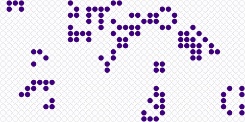

**Figure 1** Simulation of the game of life.

This is an excerpt from wikipedia entry on [Cellular Automaton](http://en.wikipedia.org/wiki/Cellular_automaton).

The Game of Life, also known simply as Life, is a cellular automaton devised by the British mathematician John Horton Conway in 1970. It is the best-known example of a cellular automaton. The "game" is actually a zero-player game, meaning that its evolution is determined by its initial state, needing no input from human players. One interacts with the Game of Life by creating an initial configuration and observing how it evolves.

The universe of the Game of Life is an infinite two-dimensional orthogonal grid of square cells, each of which is in one of two possible states, live or dead. Every cell interacts with its eight neighbours, which are the cells that are directly horizontally, vertically, or diagonally adjacent. At each step in time, the following transitions occur:

1. Any live cell with fewer than two live neighbours dies, as if by needs caused by underpopulation.
2. Any live cell with more than three live neighbours dies, as if by overcrowding.
3. Any live cell with two or three live neighbours lives, unchanged, to the next generation.
4. Any dead cell with exactly three live neighbours becomes a live cell.

The initial pattern constitutes the 'seed' of the system. The first generation is created by applying the above rules simultaneously to every cell in the seed – births and deaths happen simultaneously, and the discrete moment at which this happens is sometimes called a tick. (In other words, each generation is a pure function of the one before.) The rules continue to be applied repeatedly to create further generations.

We'll first use a very simple setup and more precisely, we'll use the [glider](http://en.wikipedia.org/wiki/Glider_(Conway's_Life)) pattern that is known to move one step diagonally in 4 iterations as illustrated below:

| | | | | |
|:-:|:-:|:-:|:-:|:-:|
|  |  |  |||
|**t = 0**|**t = 1**|**t = 2**|**t = 3**|**t = 4**|

This property will help us debug our scripts.

## 生命游戏
Numpy 倾向于科学计算，在这一节中，我们将考虑 John Conway 的 [生命游戏](http://en.wikipedia.org/wiki/Conway's_Game_of_Life)，这是细胞自动机最早的例子之一（见下图）。这些细胞自动机可以方便地被视为通过邻居的概念连接在一起的细胞数组。在接下来的部分中，我们将展示使用纯 Python 和 numpy 实现这个游戏的示例，以说明 Python 和 numpy 之间的主要差异。


**图 1** 生命游戏的模拟。

这是维基百科关于 [细胞自动机](http://en.wikipedia.org/wiki/Cellular_automaton) 条目的摘录。

生命游戏，也被称为“生命”，是由英国数学家 John Horton Conway 在 1970 年设计的一种细胞自动机。它是细胞自动机最著名的例子。“游戏”实际上是一个零玩家游戏，意味着其演变由初始状态决定，不需要人类玩家的输入。人们通过与生命游戏互动来创建初始配置并观察其如何演变。

生命游戏的宇宙是一个无限大的二维正交网格，由正方形细胞组成，每个细胞都处于两种可能状态之一，即存活或死亡。每个细胞都与其八个邻居进行交互，这些邻居是直接水平、垂直或对角线相邻的细胞。在每个时间步骤中，会发生以下转变：

1. 任何少于两个存活邻居的存活细胞会死亡，就像由于人口过少而需要死亡一样。
2. 任何多于三个存活邻居的存活细胞会死亡，就像由于过度拥挤而死亡一样。
3. 任何有两个或三个存活邻居的存活细胞会保持不变，进入下一代。
4. 任何有三个存活邻居的死亡细胞会变为存活细胞。

初始模式构成了系统的“种子”。第一代是通过同时应用上述规则到种子中的每个细胞来创建的——新生和死亡同时发生，这一离散时刻有时被称为“滴答”声。（换句话说，每一代都是前一代的纯函数。）这些规则将继续反复应用以创建更多代。

我们将首先使用一个非常简单的设置，更具体地说，我们将使用 [滑翔机](http://en.wikipedia.org/wiki/Glider_(Conway's_Life)) 模式，已知该模式在 4 次迭代中沿对角线移动一步，如下所示：

| | | | | |
|:-:|:-:|:-:|:-:|:-:|
|  |  |  |||
|**t = 0**|**t = 1**|**t = 2**|**t = 3**|**t = 4**|

这个特性将帮助我们调试我们的脚本。

### The way of python
We could have used the more efficient [python array interface](https://docs.python.org/3/library/array.html) but people may be more familiar with the list object.

In pure python, we can code the Game of Life using a list of lists representing the board where cells are supposed to evolve:

```python
>>> Z = [[0,0,0,0,0,0],
         [0,0,0,1,0,0],
         [0,1,0,1,0,0],
         [0,0,1,1,0,0],
         [0,0,0,0,0,0],
         [0,0,0,0,0,0]]
```

This board possesses a `0` border that allows to accelerate things a bit by avoiding to have specific tests for borders when counting the number of neighbours. First step is to count neighbours:

```python
def compute_neigbours(Z):
    shape = len(Z), len(Z[0])
    N  = [[0,]*(shape[0])  for i in range(shape[1])]
    for x in range(1,shape[0]-1):
        for y in range(1,shape[1]-1):
            N[x][y] = Z[x-1][y-1]+Z[x][y-1]+Z[x+1][y-1] \
                    + Z[x-1][y]            +Z[x+1][y]   \
                    + Z[x-1][y+1]+Z[x][y+1]+Z[x+1][y+1]
    return N
```

To iterate one step in time, we then simply count the number of neighbours for each internal cell and we update the whole board according to the 4 rules:

```python
def iterate(Z):
    N = compute_neighbours(Z)
    for x in range(1,shape[0]-1):
        for y in range(1,shape[1]-1):
             if Z[x][y] == 1 and (N[x][y] < 2 or N[x][y] > 3):
                 Z[x][y] = 0
             elif Z[x][y] == 0 and N[x][y] == 3:
                 Z[x][y] = 1
    return Z
```

The `show` command is supplied witht he script.

Using a dedicated display function, we can check the program's correct:

```python
>>> show(Z)
[0, 0, 1, 0]
[1, 0, 1, 0]
[0, 1, 1, 0]
[0, 0, 0, 0]

>>> for i in range(4): iterate(Z)
>>> show(Z)
[0, 0, 0, 0]
[0, 0, 0, 1]
[0, 1, 0, 1]
[0, 0, 1, 1]
```

You can download the full script here: [game-of-life-python.py](https://github.com/rougier/numpy-tutorial/blob/master/scripts/game-of-life-python.py)

### Python 的方式
我们本来可以使用更高效的 [python 数组接口](https://docs.python.org/3/library/array.html)，但人们可能更熟悉列表对象。

在纯 Python 中，我们可以使用列表的列表来表示棋盘，其中单元格应该进化，以此来编写“生命游戏”：

```python
>>> Z = [[0,0,0,0,0,0],
         [0,0,0,1,0,0],
         [0,1,0,1,0,0],
         [0,0,1,1,0,0],
         [0,0,0,0,0,0],
         [0,0,0,0,0,0]]
```

这个棋盘有一个 `0` 边框，允许通过避免在计算邻居数量时进行特定的边界测试来稍微加速计算。第一步是计算邻居数量：

```python
def compute_neigbours(Z):
    shape = len(Z), len(Z[0])
    N  = [[0,]*(shape[0])  for i in range(shape[1])]
    for x in range(1,shape[0]-1):
        for y in range(1,shape[1]-1):
            N[x][y] = Z[x-1][y-1]+Z[x][y-1]+Z[x+1][y-1] \
                    + Z[x-1][y]            +Z[x+1][y]   \
                    + Z[x-1][y+1]+Z[x][y+1]+Z[x+1][y+1]
    return N
```

为了随时间迭代一步，我们只需计算每个内部单元格的邻居数量，并根据四条规则更新整个棋盘：

```python
def iterate(Z):
    N = compute_neighbours(Z)
    for x in range(1,shape[0]-1):
        for y in range(1,shape[1]-1):
            if Z[x][y] == 1 and (N[x][y] < 2 or N[x][y] > 3):
                Z[x][y] = 0
            elif Z[x][y] == 0 and N[x][y] == 3:
                Z[x][y] = 1
    return Z
```

`show` 命令是与脚本一起提供的。

使用专门的显示函数，我们可以检查程序的正确性：

```python
>>> show(Z)
[0, 0, 1, 0]
[1, 0, 1, 0]
[0, 1, 1, 0]
[0, 0, 0, 0]

>>> for i in range(4): iterate(Z)
>>> show(Z)
[0, 0, 0, 0]
[0, 0, 0, 1]
[0, 1, 0, 1]
[0, 0, 1, 1]
```

你可以在这里下载完整的脚本：[game-of-life-python.py](https://github.com/rougier/numpy-tutorial/blob/master/scripts/game-of-life-python.py)

### The way of numpy
There exists [many more different ways](http://docs.scipy.org/doc/numpy/reference/routines.array-creation.html) to create a numpy array.

The first thing to do is to create the proper numpy array to hold the cells. This can be done very easily with:

```python
>>> import numpy as np
>>> Z = np.array([[0,0,0,0,0,0],
                  [0,0,0,1,0,0],
                  [0,1,0,1,0,0],
                  [0,0,1,1,0,0],
                  [0,0,0,0,0,0],
                  [0,0,0,0,0,0]])
```

For a complete review on numpy data types, check the [documentation](http://docs.scipy.org/doc/numpy/reference/arrays.dtypes.html).

Note that we did not specify the [data type](https://github.com/rougier/numpy-tutorial/blob/master/README.rst#data-type) of the array and thus, numpy will choose one for us. Since all elements are integers, numpy will then choose an integer data type. This can be easily checked using:

```python
>>> print(Z.dtype)
int64
```

We can also check the shape of the array to make sure it is 6x6:

```python
>>> print(Z.shape)
(6, 6)
```

Each element of Z can be accessed using a row and a column index (in that order):

```python
>>> print(Z[0,5])
0
```

This element access is actually called [indexing](http://docs.scipy.org/doc/numpy/reference/arrays.indexing.html) and this is very powerful tool for vectorized computation.

But even better, we can also access a subpart of the array using the slice notation:

```python
>>> print(Z[1:5,1:5])
[[0 0 1 0]
 [1 0 1 0]
 [0 1 1 0]
 [0 0 0 0]]
```

In the example above, we actually extract a subpart of Z ranging from rows 1 to 5 and columns 1 to 5. It is important to understand at this point that this is really a subpart of `Z` in the sense that any change to this subpart will have immediate impact on `Z`:

```python
>>> A = Z[1:5,1:5]
>>> A[0,0] = 9
>>> print(A)
[[9 0 1 0]
 [1 0 1 0]
 [0 1 1 0]
 [0 0 0 0]]

>>> print(Z)
[[0 0 0 0 0 0]
 [0 9 0 1 0 0]
 [0 1 0 1 0 0]
 [0 0 1 1 0 0]
 [0 0 0 0 0 0]
 [0 0 0 0 0 0]]
```

We set the value of `A[0,0]` to 9 and we see immediate change in `Z[1,1]` because `A[0,0]` actually corresponds to `Z[1,1]`. This may seem trivial with such simple arrays, but things can become much more complex (we'll see that later). If in doubt, you can check easily if an array is part of another one:

```python
>>> print(Z.base is None)
True
>>> print(A.base is Z)
True
```

### NumPy 的方式
存在[许多不同的方式](http://docs.scipy.org/doc/numpy/reference/routines.array-creation.html)来创建 NumPy 数组。

首先要做的是创建一个合适的 NumPy 数组来存储单元格。这可以通过以下方式轻松完成：

```python
>>> import numpy as np
>>> Z = np.array([[0,0,0,0,0,0],
                  [0,0,0,1,0,0],
                  [0,1,0,1,0,0],
                  [0,0,1,1,0,0],
                  [0,0,0,0,0,0],
                  [0,0,0,0,0,0]])
```

要全面了解 NumPy 数据类型，请查阅[文档](http://docs.scipy.org/doc/numpy/reference/arrays.dtypes.html)。

请注意，我们没有指定数组的[数据类型](https://github.com/rougier/numpy-tutorial/blob/master/README.rst#data-type)，因此，NumPy 会为我们选择一个。由于所有元素都是整数，NumPy 将选择整数数据类型。这可以通过以下方式轻松检查：

```python
>>> print(Z.dtype)
int64
```

我们还可以检查数组的形状以确保它是 6x6：

```python
>>> print(Z.shape)
(6, 6)
```

可以使用行和列索引（按此顺序）来访问 Z 的每个元素：

```python
>>> print(Z[0,5])
0
```

这种元素访问实际上被称为[索引](http://docs.scipy.org/doc/numpy/reference/arrays.indexing.html)，这是向量化计算中非常强大的工具。

但更好的是，我们还可以使用切片符号来访问数组的子部分：

```python
>>> print(Z[1:5,1:5])
[[0 0 1 0]
 [1 0 1 0]
 [0 1 1 0]
 [0 0 0 0]]
```

在上面的例子中，我们实际上提取了 Z 的一个子部分，范围是从第 1 行到第 5 行和第 1 列到第 5 列。重要的是要理解，在这个意义上，这确实是 `Z` 的一个子部分，因为对这个子部分的任何更改都会立即影响 `Z`：

```python
>>> A = Z[1:5,1:5]
>>> A[0,0] = 9
>>> print(A)
[[9 0 1 0]
 [1 0 1 0]
 [0 1 1 0]
 [0 0 0 0]]

>>> print(Z)
[[0 0 0 0 0 0]
 [0 9 0 1 0 0]
 [0 1 0 1 0 0]
 [0 0 1 1 0 0]
 [0 0 0 0 0 0]
 [0 0 0 0 0 0]]
```

我们将 `A[0,0]` 的值设置为 9，并立即看到 `Z[1,1]` 的变化，因为 `A[0,0]` 实际上对应于 `Z[1,1]`。对于这样简单的数组来说，这可能看起来微不足道，但事情可能会变得更加复杂（我们稍后会看到）。如果有疑问，你可以很容易地检查一个数组是否是另一个数组的一部分：

```python
>>> print(Z.base is None)
True
>>> print(A.base is Z)
True
```

#### Counting neighbours
It is not always possible to vectorize computations and it requires generally some experience. You'll acquire this experience by using numpy (of course) but also by asking questions on the [mailing list](http://mail.scipy.org/mailman/listinfo/numpy-discussion)

We now need a function to count the neighbours. We could do it the same way as for the python version, but this would make things very slow because of the nested loops. We would prefer to act on the whole array whenever possible, this is called vectorization.

Ok, let's start then...

First, you need to know that you can manipulate `Z` as if (and only as if) it was a regular scalar:

```python
>>> print(1+(2*Z+3))
[[4 4 4 4 4 4]
 [4 4 4 6 4 4]
 [4 6 4 6 4 4]
 [4 4 6 6 4 4]
 [4 4 4 4 4 4]
 [4 4 4 4 4 4]]
```

If you look carefully at the output, you may realize that the ouptut corresponds to the formula above applied individually to each element. Said differently, we have `(1+(2*Z+3))[i,j] == (1+(2*Z[i,j]+3))` for any i,j.

Ok, so far, so good. Now what happens if we add Z with one of its subpart, let's say `Z[1:-1,1:-1]` ?

```python
>>> Z + Z[1:-1,1:-1]
Traceback (most recent call last):
File "<stdin>", line 1, in <module>
ValueError: operands could not be broadcast together with shapes (6,6) (4,4)  
```

This raises a `Value Error`, but more interestingly, numpy complains about the impossibility of broadcasting the two arrays together. [Broadcasting](https://github.com/rougier/numpy-tutorial/blob/master/README.rst#broadcasting) is a very powerful feature of numpy and most of the time, it saves you a lot of hassle. Let's consider for example the following code:

```python
>>> print(Z+1)
[[1 1 1 1 1 1]
 [1 1 1 2 1 1]
 [1 2 1 2 1 1]
 [1 1 2 2 1 1]
 [1 1 1 1 1 1]
 [1 1 1 1 1 1]]
```

See also [the broadcasting section](http://docs.scipy.org/doc/numpy/user/basics.broadcasting.html) in the numpy documentation.

How can a matrix and a scalar be added together ? Well, they can't. But numpy is smart enough to guess that you actually want to add 1 to each of the element of `Z`. This concept of broadcasting is quite powerful and it will take you some time before masterizing it fully (if even possible).

However, in the present case (counting neighbours if you remember), we won't use broadcasting (uh ?). But we'll use vectorize computation using the following code:

```python
>>> N = np.zeros(Z.shape, dtype=int)
>>> N[1:-1,1:-1] += (Z[ :-2, :-2] + Z[ :-2,1:-1] + Z[ :-2,2:] +
                     Z[1:-1, :-2]                + Z[1:-1,2:] +
                     Z[2:  , :-2] + Z[2:  ,1:-1] + Z[2:  ,2:])
```

To understand this code, have a look at the figure below:

| | | |
|:-:|:-:|:-:|
| 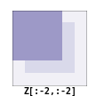 | 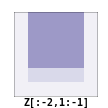 | 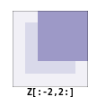 |
|  | 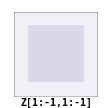 | 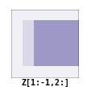 |
| 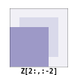 |  | 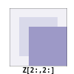 |

What we actually did with the above code is to add all the darker blue squares together. Since they have been chosen carefully, the result will be exactly what we expected. If you want to convince yourself, consider a cell in the lighter blue area of the central sub-figure and check what will the result for a given cell.

#### 计算邻居

并非总是可以对计算进行矢量化，这通常需要一些经验。你将通过使用numpy（当然）以及在[邮件列表](http://mail.scipy.org/mailman/listinfo/numpy-discussion)上提问来获得这种经验。

现在我们需要一个函数来计算邻居的数量。我们可以像Python版本那样做，但这样做会因为嵌套循环而使事情变得非常慢。我们更希望在可能的情况下对整个数组进行操作，这称为矢量化。

好的，那么让我们开始吧...

首先，你需要知道你可以像（并且仅当）它是一个常规标量那样来操作`Z`：

```python
>>> print(1+(2*Z+3))
[[4 4 4 4 4 4]
 [4 4 4 6 4 4]
 [4 6 4 6 4 4]
 [4 4 6 6 4 4]
 [4 4 4 4 4 4]
 [4 4 4 4 4 4]]
```

如果你仔细观察输出，可能会发现输出对应于上面公式对每个元素单独应用的结果。换句话说，对于任何i,j，我们有`(1+(2*Z+3))[i,j] == (1+(2*Z[i,j]+3))`。

好的，到目前为止还不错。现在如果我们将`Z`与其子部分之一相加，比如`Z[1:-1,1:-1]`，会发生什么？

```python
>>> Z + Z[1:-1,1:-1]
Traceback (most recent call last):
File "<stdin>", line 1, in <module>
ValueError: operands could not be broadcast together with shapes (6,6) (4,4)
```

这引发了一个`ValueError`，但更有趣的是，numpy抱怨无法将这两个数组一起广播。[广播](https://github.com/rougier/numpy-tutorial/blob/master/README.rst#broadcasting)是numpy的一个非常强大的特性，大多数情况下，它为你节省了很多麻烦。让我们考虑以下代码为例：

```python
>>> print(Z+1)
[[1 1 1 1 1 1]
 [1 1 1 2 1 1]
 [1 2 1 2 1 1]
 [1 1 2 2 1 1]
 [1 1 1 1 1 1]
 [1 1 1 1 1 1]]
```

请参阅numpy文档中的[广播部分](http://docs.scipy.org/doc/numpy/user/basics.broadcasting.html)。

一个矩阵和一个标量是如何相加的呢？嗯，它们不能直接相加。但是numpy足够聪明，能够猜测到你实际上是想给`Z`中的每个元素都加上1。这种广播的概念非常强大，你需要一些时间才能完全掌握它（甚至可能无法完全掌握）。

然而，在当前的情况下（如果你还记得的话，是计算邻居的数量），我们不会使用广播（嗯？）。但是我们会使用以下代码来进行矢量化计算：

```python
>>> N = np.zeros(Z.shape, dtype=int)
>>> N[1:-1,1:-1] += (Z[ :-2, :-2] + Z[ :-2,1:-1] + Z[ :-2,2:] +
                     Z[1:-1, :-2]                + Z[1:-1,2:] +
                     Z[2:  , :-2] + Z[2:  ,1:-1] + Z[2:  ,2:])
```

为了理解这段代码，请查看下面的图表：

| | | |
|:-:|:-:|:-:|
|  |  |  |
|  |  |  |
|  |  |  |

我们实际上使用上面的代码将所有深蓝色方块相加。由于我们精心选择了这些方块，所以结果将完全符合预期。如果你想自己验证一下，可以考虑中央子图中浅蓝色区域的一个单元格，并检查给定单元格的结果会是什么。

#### Iterate

Note the use of the [ravel](http://docs.scipy.org/doc/numpy/reference/generated/numpy.ravel.html?highlight=ravel#numpy.ravel) function that flatten an array. This is necessary since the argwhere function returns flattened indices.

In a first approach, we can write the iterate function using the [argwhere](http://docs.scipy.org/doc/numpy/reference/generated/numpy.argwhere.html) method that will give us the indices where a given condition is True.

```python
def iterate(Z):
    # Iterate the game of life : naive version
    # Count neighbours
    N = np.zeros(Z.shape, int)
    N[1:-1,1:-1] += (Z[0:-2,0:-2] + Z[0:-2,1:-1] + Z[0:-2,2:] +
                     Z[1:-1,0:-2]                + Z[1:-1,2:] +
                     Z[2:  ,0:-2] + Z[2:  ,1:-1] + Z[2:  ,2:])
    N_ = N.ravel()
    Z_ = Z.ravel()

    # Apply rules
    R1 = np.argwhere( (Z_==1) & (N_ < 2) )
    R2 = np.argwhere( (Z_==1) & (N_ > 3) )
    R3 = np.argwhere( (Z_==1) & ((N_==2) | (N_==3)) )
    R4 = np.argwhere( (Z_==0) & (N_==3) )

    # Set new values
    Z_[R1] = 0
    Z_[R2] = 0
    Z_[R3] = Z_[R3]
    Z_[R4] = 1

    # Make sure borders stay null
    Z[0,:] = Z[-1,:] = Z[:,0] = Z[:,-1] = 0
```

Even if this first version does not use nested loops, it is far from optimal because of the use of the 4 argwhere calls that may be quite slow. We can instead take advantages of numpy features the following way.

```python
def iterate_2(Z):
    # Count neighbours
    N = (Z[0:-2,0:-2] + Z[0:-2,1:-1] + Z[0:-2,2:] +
         Z[1:-1,0:-2]                + Z[1:-1,2:] +
         Z[2:  ,0:-2] + Z[2:  ,1:-1] + Z[2:  ,2:])

    # Apply rules
    birth = (N==3) & (Z[1:-1,1:-1]==0)
    survive = ((N==2) | (N==3)) & (Z[1:-1,1:-1]==1)
    Z[...] = 0
    Z[1:-1,1:-1][birth | survive] = 1
    return Z
```

If you look at the `birth` and `survive` lines, you'll see that these two variables are indeed arrays. The right-hand side of these two expressions are in fact logical expressions that will result in boolean arrays (just print them to check). We then set all `Z` values to 0 (all cells become dead) and we use the `birth` and `survive` arrays to conditionally set `Z` values to 1. And we're done ! Let's test this:

```python
>>> print(Z)
[[0 0 0 0 0 0]
 [0 0 0 1 0 0]
 [0 1 0 1 0 0]
 [0 0 1 1 0 0]
 [0 0 0 0 0 0]
 [0 0 0 0 0 0]]
>>> for i in range(4): iterate_2(Z)
>>> print(Z)
[[0 0 0 0 0 0]
 [0 0 0 0 0 0]
 [0 0 0 0 1 0]
 [0 0 1 0 1 0]
 [0 0 0 1 1 0]
 [0 0 0 0 0 0]] 
```

You can download the full script here: [game-of-life-numpy.py](https://github.com/rougier/numpy-tutorial/blob/master/scripts/game-of-life-numpy.py)

#### 迭代

注意使用 [ravel](http://docs.scipy.org/doc/numpy/reference/generated/numpy.ravel.html?highlight=ravel#numpy.ravel) 函数来展平数组。这是必要的，因为 argwhere 函数返回的是展平的索引。

在第一种方法中，我们可以使用 [argwhere](http://docs.scipy.org/doc/numpy/reference/generated/numpy.argwhere.html) 方法来编写迭代函数，该方法将给出给定条件为 True 的索引。

```python
def iterate(Z):
    # 迭代生命游戏：朴素版本
    # 计算邻居
    N = np.zeros(Z.shape, int)
    N[1:-1,1:-1] += (Z[0:-2,0:-2] + Z[0:-2,1:-1] + Z[0:-2,2:] +
                     Z[1:-1,0:-2]                + Z[1:-1,2:] +
                     Z[2:  ,0:-2] + Z[2:  ,1:-1] + Z[2:  ,2:])
    N_ = N.ravel()
    Z_ = Z.ravel()

    # 应用规则
    R1 = np.argwhere( (Z_==1) & (N_ < 2) )
    R2 = np.argwhere( (Z_==1) & (N_ > 3) )
    R3 = np.argwhere( (Z_==1) & ((N_==2) | (N_==3)) )
    R4 = np.argwhere( (Z_==0) & (N_==3) )

    # 设置新值
    Z_[R1] = 0
    Z_[R2] = 0
    Z_[R3] = Z_[R3]
    Z_[R4] = 1

    # 确保边界保持为0
    Z[0,:] = Z[-1,:] = Z[:,0] = Z[:,-1] = 0
```

即使这个版本没有使用嵌套循环，但由于使用了四个可能相当慢的argwhere调用，它仍然远非最优。相反，我们可以按以下方式利用numpy的特性。

```python
def iterate_2(Z):
    # 计算邻居
    N = (Z[0:-2,0:-2] + Z[0:-2,1:-1] + Z[0:-2,2:] +
         Z[1:-1,0:-2]                + Z[1:-1,2:] +
         Z[2:  ,0:-2] + Z[2:  ,1:-1] + Z[2:  ,2:])

    # 应用规则
    birth = (N==3) & (Z[1:-1,1:-1]==0)  # 出生条件
    survive = ((N==2) | (N==3)) & (Z[1:-1,1:-1]==1)  # 存活条件
    Z[...] = 0  # 所有Z值设为0（所有细胞变为死亡）
    Z[1:-1,1:-1][birth | survive] = 1  # 使用birth和survive数组有条件地将Z值设为1
    return Z
```

如果你查看`birth`和`survive`这两行代码，你会看到这两个变量实际上是数组。这两个表达式右边的实际上是逻辑表达式，它们会生成布尔数组（只需打印它们来检查）。然后，我们将所有`Z`值设为0（所有单元格变为死亡），并使用`birth`和`survive`数组有条件地将`Z`值设为1。这样就完成了！让我们测试一下：

```python
>>> print(Z)
[[0 0 0 0 0 0]
 [0 0 0 1 0 0]
 [0 1 0 1 0 0]
 [0 0 1 1 0 0]
 [0 0 0 0 0 0]
 [0 0 0 0 0 0]]
>>> for i in range(4): iterate_2(Z)
>>> print(Z)
[[0 0 0 0 0 0]
 [0 0 0 0 0 0]
 [0 0 0 0 1 0]
 [0 0 1 0 1 0]
 [0 0 0 1 1 0]
 [0 0 0 0 0 0]]
```

你可以在这里下载完整的脚本：[game-of-life-numpy.py](https://github.com/rougier/numpy-tutorial/blob/master/scripts/game-of-life-numpy.py)

#### Getting bigger
While numpy works perfectly with very small arrays, you'll really benefit from numpy power with big to very big arrays. So let us reconsider the game of life with a bigger array. First, we won't initalize the array by hand but initalize it randomly:

```python
>>> Z = np.random.randint(0,2,(256,512))
```

and we simply iterate as previously:

```python
>>> for i in range(100): iterate(Z)
```

and display result:

```python
>>> size = np.array(Z.shape)
>>> dpi = 72.0
>>> figsize= size[1]/float(dpi),size[0]/float(dpi)
>>> fig = plt.figure(figsize=figsize, dpi=dpi, facecolor="white")
>>> fig.add_axes([0.0, 0.0, 1.0, 1.0], frameon=False)
>>> plt.imshow(Z,interpolation='nearest', cmap=plt.cm.gray_r)
>>> plt.xticks([]), plt.yticks([])
>>> plt.show()
```

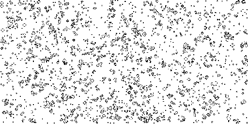

Easy enough, no ?

#### 再大一点
虽然numpy在处理非常小的数组时表现完美，但当你处理大到非常大的数组时，numpy的真正优势才会体现出来。因此，让我们用更大的数组重新考虑生命游戏。首先，我们不会手动初始化数组，而是随机初始化它：

```python
>>> Z = np.random.randint(0,2,(256,512))
```

然后我们简单地像以前一样迭代：

```python
>>> for i in range(100): iterate(Z)
```

并显示结果：

```python
>>> size = np.array(Z.shape)
>>> dpi = 72.0
>>> figsize= size[1]/float(dpi),size[0]/float(dpi)
>>> fig = plt.figure(figsize=figsize, dpi=dpi, facecolor="white")
>>> fig.add_axes([0.0, 0.0, 1.0, 1.0], frameon=False)
>>> plt.imshow(Z, interpolation='nearest', cmap=plt.cm.gray_r)
>>> plt.xticks([]), plt.yticks([])
>>> plt.show()
```


很简单，不是吗？

#### A step further
We have reviewed the very basics of numpy so let's move on to more complex (and more fun) things.

Description taken from the [Gray-Scott homepage](http://groups.csail.mit.edu/mac/projects/amorphous/GrayScott/)

Reaction and diffusion of chemical species can produce a variety of patterns, reminiscent of those often seen in nature. The Gray Scott equations model such a reaction. For more information on this chemical system see the article **Complex Patterns in a Simple System**, John E. Pearson, Science, Volume 261, 9 July 1993.

Let's consider two chemical species U and V with respective concentrations u and v and diffusion rates ru and rv. V is converted into P with a rate of conversion k. f represents the rate of the process that feeds U and drains U, V and P. We can now write:

| Chemical reaction | Equations |
|:-:|:-:|
| $$U + 2V  \longrightarrow 3V$$ | $$\frac{\partial u}{\partial t} = r_u \nabla^2 u - uv^2 + f(1-u)$$ |
| $$V  \longrightarrow P$$ | $$\frac{\partial v}{\partial t} = r_v \nabla^2 v + uv^2 - (f+k)v$$ |

Examples
(click figure to see movie)

**bacteria**


**fingerprint**
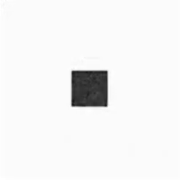

**zebra**


Obviously, you may think we need two arrays, one for U and for V. But since U and V are tighly linked, it may be indeed better to use a single array. Numpy allows to do that with the notion of [structured array](http://docs.scipy.org/doc/numpy/user/basics.rec.html):

```python
>>> n = 200
>>> Z = np.zeros((n+2,n+2), [('U', np.double),
                             ('V', np.double)])
>>> print(Z.dtype)
[('U', '<f8'), ('V', '<f8')]
```

The size of the array is (n+2,n+2) since we need the borders when computing the neighbours. However, we'll compute differential equation only in the center part, so we can already creates some useful views of this array:

```python
>>> U,V = Z['U'], Z['V']
>>> u,v = U[1:-1,1:-1], V[1:-1,1:-1]
```

Next, we need to compute the Laplacian and we'll use a discrete approximation obtained via the finite difference method using the same vectorization as for the Game of Life:

```python
def laplacian(Z):
    return (                 Z[0:-2,1:-1] +
            Z[1:-1,0:-2] - 4*Z[1:-1,1:-1] + Z[1:-1,2:] +
                             Z[2:  ,1:-1] )
```

Finally, we can iterate the computation after choosing some interesting parameters:

```python
for i in range(25000):
    Lu = laplacian(U)
    Lv = laplacian(V)
    uvv = u*v*v
    u += (Du*Lu - uvv +  F   *(1-u))
    v += (Dv*Lv + uvv - (F+k)*v    )
```

And we're done !

You can download the full script here: [gray-scott.py](https://github.com/rougier/numpy-tutorial/blob/master/scripts/gray-scott.py)

#### 再进一步
我们已经回顾了numpy的基础知识，现在让我们转向更复杂（也更有趣）的内容。

描述来自[Gray-Scott主页](http://groups.csail.mit.edu/mac/projects/amorphous/GrayScott/)

化学物种的反应和扩散可以产生多种模式，让人联想到自然界中经常看到的那些。Gray-Scott方程模拟了这样的反应。要了解有关此化学系统的更多信息，请参阅文章《**简单系统中的复杂模式**》，作者John E. Pearson，发表于《科学》杂志，第261卷，1993年7月9日。

让我们考虑两种化学物种U和V，它们各自的浓度为u和v，扩散率分别为ru和rv。V以k的速率转化为P。f表示喂养U并消耗U、V和P的过程的速率。现在我们可以写下：

| 化学反应 | 方程 |
|:-:|:-:|
| $$U + 2V  \longrightarrow 3V$$ | $$\frac{\partial u}{\partial t} = r_u \nabla^2 u - uv^2 + f(1-u)$$ |
| $$V  \longrightarrow P$$ | $$\frac{\partial v}{\partial t} = r_v \nabla^2 v + uv^2 - (f+k)v$$ |

示例
（点击图片查看动画）

**细菌**


**指纹**


**斑马**


显然，你可能会认为我们需要两个数组，一个用于U，一个用于V。但由于U和V紧密相关，实际上使用单个数组可能会更好。Numpy通过[结构化数组](http://docs.scipy.org/doc/numpy/user/basics.rec.html)的概念允许我们这样做：

```python
>>> n = 200
>>> Z = np.zeros((n+2,n+2), [('U', np.double),
                             ('V', np.double)])
>>> print(Z.dtype)
[('U', '<f8'), ('V', '<f8')]
```

数组的大小是(n+2,n+2)，因为我们在计算邻居时需要边界。然而，我们只在中心部分计算微分方程，所以我们可以预先创建这个数组的一些有用的视图：

```python
>>> U,V = Z['U'], Z['V']
>>> u,v = U[1:-1,1:-1], V[1:-1,1:-1]
```

接下来，我们需要计算拉普拉斯算子，我们将使用有限差分法得到的离散近似，并使用与《生命游戏》相同的矢量化方法：

```python
def laplacian(Z):
    return (Z[0:-2,1:-1] +
            Z[1:-1,0:-2] - 4*Z[1:-1,1:-1] + Z[1:-1,2:] +
            Z[2:,1:-1])
```

最后，在选择了某些有趣的参数之后，我们可以迭代计算：

```python
for i in range(25000):
    Lu = laplacian(U)
    Lv = laplacian(V)
    uvv = u*v*v
    u += (Du*Lu - uvv + F*(1-u))
    v += (Dv*Lv + uvv - (F+k)*v)
```

大功告成！

你可以在这里下载完整的脚本：[gray-scott.py](https://github.com/rougier/numpy-tutorial/blob/master/scripts/gray-scott.py)

## Exercises
Here are some exercises, try to do them without looking at the solution (just highligh the blank part to see it).

## 练习
以下是一些练习，尝试在不看解决方案的情况下完成它们（只需高亮显示空白部分以查看答案）。

### Neophyte
1. Import the numpy package under the name `np`

```python
import numpy as np
```

2. Print the numpy version and the configuration.

```python
print(np.__version__)
np.__config__.show()
```

3. Create a null vector of size 10

```python
Z = np.zeros(10)
```

4. Create a null vector of size 10 but the fifth value which is 1

```python
Z = np.zeros(10)
Z[4] = 1
```

5. Create a vector with values ranging from 10 to 99

```python
Z = 10 + np.arange(90)
```

6. Create a 3x3 matrix with values ranging from 0 to 8

```python
Z = np.arange(9).reshape(3,3)
```

7. Find indices of non-zero elements from [1,2,0,0,4,0]

```python
print(np.nonzero([1,2,0,0,4,0]))
```

8. Declare a 3x3 identity matrix

```python
Z = np.eye(3)
```

9. Declare a 5x5 matrix with values 1,2,3,4 just below the diagonal

```python
Z = np.diag(1+np.arange(4),k=-1)  
```

10. Declare a 10x10x10 array with random values

```python
Z = np.random.random((10,10,10))
```

### 初学者
1. 将numpy包导入为`np`

```python
import numpy as np
```

2. 打印numpy的版本和配置信息。

```python
print(np.__version__)
np.__config__.show()
```

3. 创建一个大小为10的零向量

```python
Z = np.zeros(10)
```

4. 创建一个大小为10的零向量，但第五个值为1

```python
Z = np.zeros(10)
Z[4] = 1
```

5. 创建一个值从10到99的向量

```python
Z = np.arange(10, 100)
```

6. 创建一个3x3的矩阵，其值从0到8

```python
Z = np.arange(9).reshape(3,3)
```

7. 找出[1,2,0,0,4,0]中非零元素的索引

```python
print(np.nonzero([1,2,0,0,4,0]))
```

8. 声明一个3x3的单位矩阵

```python
Z = np.eye(3)
```

9. 声明一个5x5的矩阵，其值1,2,3,4位于对角线下方

```python
Z = np.diag(1+np.arange(4), k=-1)  
```

10. 声明一个10x10x10的数组，其值为随机数

```python
Z = np.random.random((10,10,10))
```

### Novice

1. Declare a 8x8 matrix and fill it with a checkerboard pattern

```python
Z = np.zeros((8,8))
Z[1::2,::2] = 1
Z[::2,1::2] = 1
```

2. Declare a 10x10 array with random values and find the minimum and maximum values

```python
Z = np.random.random((10,10,10))
Zmin, Zmax = Z.min(), Z.max()
```

3. Create a checkerboard 8x8 matrix using the tile function

```python
Z = np.tile( np.array([[0,1],[1,0]]), (4,4))
```

4. Normalize a 5x5 random matrix (between 0 and 1)

```python
Z = np.random.random((5,5))
Zmax,Zmin = Z.max(), Z.min()
Z = (Z - Zmin)/(Zmax - Zmin)
```

5. Multiply a 5x3 matrix by a 3x2 matrix (real matrix product)

```python
Z = np.dot(np.ones((5,3)), np.ones((3,2)))
```

6. Create a 10x10 matrix with row values ranging from 0 to 9

```python
Z = np.zeros((10,10))
Z += np.arange(10)
```

7. Create a vector of size 1000 with values ranging from 0 to 1, both excluded

```python
Z = np.random.linspace(0,1,1002,endpoint=True)[1:-1]
```

8. Create a random vector of size 100 and sort it

```python
Z = np.random.random(100)
Z.sort()
```

9. Consider two random matrices A anb B, check if they are equal.

```python
A = np.random.randint(0,2,(2,2))
B = np.random.randint(0,2,(2,2))
equal = np.allclose(A,B)
```

10. Create a random vector of size 1000 and find the mean value

```python
Z = np.random.random(1000)
m = Z.mean()
```

### 新手

1. 声明一个8x8的矩阵并用棋盘模式填充它

```python
Z = np.zeros((8,8))
Z[1::2,::2] = 1
Z[::2,1::2] = 1
```

2. 声明一个10x10的数组并用随机数填充它，然后找出最小值和最大值

```python
Z = np.random.random((10,10))
Zmin, Zmax = Z.min(), Z.max()
```

3. 使用tile函数创建一个棋盘模式的8x8矩阵

```python
Z = np.tile( np.array([[0,1],[1,0]]), (4,4))
```

4. 将一个5x5的随机矩阵（值在0和1之间）归一化

```python
Z = np.random.random((5,5))
Zmax, Zmin = Z.max(), Z.min()
Z = (Z - Zmin) / (Zmax - Zmin)
```

5. 将一个5x3的矩阵与一个3x2的矩阵相乘（真实的矩阵乘积）

```python
Z = np.dot(np.ones((5,3)), np.ones((3,2)))
```

6. 创建一个10x10的矩阵，其行值从0到9

```python
Z = np.zeros((10,10))
Z += np.arange(10)
```

7. 创建一个大小为1000的向量，其值从0到1（两者都不包括）

```python
Z = np.random.uniform(0, 1, 1000)
```

8. 创建一个大小为100的随机向量并对其进行排序

```python
Z = np.random.random(100)
Z.sort()
```

9. 考虑两个随机矩阵A和B，检查它们是否相等。

```python
A = np.random.randint(0,2,(2,2))
B = np.random.randint(0,2,(2,2))
equal = np.array_equal(A, B)
```

10. 创建一个大小为1000的随机向量并找到其平均值

```python
Z = np.random.random(1000)
m = Z.mean()
```

### Apprentice

1. Consider a random 100x2 matrix representing cartesian coordinates, convert them to polar coordinates

```python
Z = np.random.random((100,2))
X,Y = Z[:,0], Z[:,1]
R = np.sqrt(X**2+Y**2)
T = np.arctan2(Y,X)
```

2. Create random vector of size 100 and replace the maximum value by 0

```python
Z = np.random.random(100)
Z[Z.argmax()] = 0
```

3. Declare a structured array with x and y coordinates covering the [0,1]x[0,1] area.

```python
Z = np.zeros((10,10), [('x',float),('y',float)])
Z['x'], Z['y'] = np.meshgrid(np.linspace(0,1,10),
                             np.linspace(0,1,10))
```

4. Print the minimum and maximum representable value for each numpy scalar type

```python
for dtype in [np.int8, np.int32, np.int64]:
   print(np.iinfo(dtype).min)
   print(np.iinfo(dtype).max)
for dtype in [np.float32, np.float64]:
   print(np.finfo(dtype).min)
   print(np.finfo(dtype).max)
   print(np.finfo(dtype).eps)
```

5. Create a structured array representing a position (x,y) and a color (r,g,b)

```python
Z = np.zeros(10, [ ('position', [ ('x', float, 1),
                                  ('y', float, 1)]),
                   ('color',    [ ('r', float, 1),
                                  ('g', float, 1),
                                  ('b', float, 1)])])
```

6. Consider a random vector with shape (100,2) representing coordinates, find point by point distances

```python
Z = np.random.random((10,2))
X,Y = np.atleast_2d(Z[:,0]), np.atleast_2d(Z[:,1])
D = np.sqrt( (X-X.T)**2 + (Y-Y.T)**2)
```

7. Generate a generic 2D Gaussian-like array

```python
X, Y = np.meshgrid(np.linspace(-1,1,100), np.linspace(-1,1,100))
D = np.sqrt(X*X+Y*Y)
sigma, mu = 1.0, 0.0
G = np.exp(-( (D-mu)**2 / ( 2.0 * sigma**2 ) ) )
```

8. Consider the vector [1, 2, 3, 4, 5], how to build a new vector with 3 consecutive zeros interleaved between each value ?

```python
Z = np.array([1,2,3,4,5])
nz = 3
Z0 = np.zeros(len(Z) + (len(Z)-1)*(nz))
Z0[::nz+1] = Z
```

### 学徒

1. 考虑一个代表笛卡尔坐标的随机100x2矩阵，将其转换为极坐标

```python
Z = np.random.random((100,2))
X, Y = Z[:,0], Z[:,1]
R = np.sqrt(X**2 + Y**2)
T = np.arctan2(Y, X)
```

2. 创建一个大小为100的随机向量，并将最大值替换为0

```python
Z = np.random.random(100)
Z[Z.argmax()] = 0
```

3. 声明一个结构化数组，其中包含覆盖[0,1]x[0,1]区域的x和y坐标。

```python
Z = np.zeros((10,10), dtype=[('x',float),('y',float)])
Z['x'], Z['y'] = np.meshgrid(np.linspace(0,1,10),
                             np.linspace(0,1,10))
```

4. 打印每种numpy标量类型的最小和最大可表示值

```python
for dtype in [np.int8, np.int32, np.int64]:
    print(np.iinfo(dtype).min)
    print(np.iinfo(dtype).max)
for dtype in [np.float32, np.float64]:
    print(np.finfo(dtype).min)
    print(np.finfo(dtype).max)
    print(np.finfo(dtype).eps)
```

5. 创建一个结构化数组，表示位置(x,y)和颜色(r,g,b)

```python
Z = np.zeros(10, dtype=[('position', [('x', float, 1),
                                      ('y', float, 1)]),
                        ('color', [('r', float, 1),
                                   ('g', float, 1),
                                   ('b', float, 1)])])
```

6. 考虑一个形状为(100,2)的随机向量，表示坐标，找出逐点之间的距离

```python
Z = np.random.random((100,2))
X, Y = Z[:,0], Z[:,1]
D = np.sqrt((X[:,None] - X)**2 + (Y[:,None] - Y)**2)
```

7. 生成一个类似二维高斯分布的通用数组

```python
X, Y = np.meshgrid(np.linspace(-1,1,100), np.linspace(-1,1,100))
D = np.sqrt(X*X+Y*Y)
sigma, mu = 1.0, 0.0
G = np.exp(-( (D-mu)**2 / ( 2.0 * sigma**2 ) ) )
```

8. 考虑向量[1, 2, 3, 4, 5]，如何构建一个新向量，在每个值之间插入3个连续的零？

```python
Z = np.array([1,2,3,4,5])
nz = 3
Z0 = np.zeros(len(Z) + (len(Z)-1)*(nz))
Z0[::nz+1] = Z
```

## Beyond this tutorial
Numpy benefits from extensive documentation as well as a large community of users and developpers. Here are some links of interest:

## 超越本教程
Numpy 受益于广泛的文档支持以及庞大的用户和开发者社区。以下是一些可能有用的链接：

### Other Tutorials

* [The SciPy Lecture Notes](http://scipy-lectures.github.io/)
  The SciPy Lecture notes offers a teaching material on the scientific Python ecosystem as well as quick introduction to central tools and techniques. The different chapters each correspond to a 1 to 2 hours course with increasing level of expertise, from beginner to expert.
* [Numpy MedKit](http://mentat.za.net/numpy/numpy_advanced_slides/)
  A first-aid kit for the numerically adventurous by Stéfan van der Walt.
* [An introduction to Numpy and Scipy](http://www.engr.ucsb.edu/~shell/che210d/numpy.pdf)
  A short introduction to Numpy and Scipy by M. Scott Shell.

### 其他教程

* [SciPy 讲座笔记](http://scipy-lectures.github.io/)
  SciPy 讲座笔记提供了科学 Python 生态系统的教学材料，以及对核心工具和技术的快速介绍。不同的章节各自对应于 1 到 2 小时的课程，从初学者到专家，难度逐渐增加。
* [Numpy 急救包](http://mentat.za.net/numpy/numpy_advanced_slides/)
  Stéfan van der Walt 为数值冒险者提供的急救包。
* [Numpy 和 Scipy 入门](http://www.engr.ucsb.edu/~shell/che210d/numpy.pdf)
  M. Scott Shell 编写的 Numpy 和 Scipy 简短介绍。

### Numpy documentation

* [User guide](http://docs.scipy.org/doc/numpy/user/)
  This guide is intended as an introductory overview of NumPy and explains how to install and make use of the most important features of NumPy.
* [Numpy reference](http://docs.scipy.org/doc/numpy/reference/index.html#reference)
  This reference manual details functions, modules, and objects included in Numpy, describing what they are and what they do.
* [FAQ](http://www.scipy.org/FAQ)

### Numpy 文档

* [用户指南](http://docs.scipy.org/doc/numpy/user/)
  本指南旨在作为 NumPy 的入门概述，并解释如何安装和使用 NumPy 的最重要功能。
* [Numpy 参考手册](http://docs.scipy.org/doc/numpy/reference/index.html#reference)
  本参考手册详细说明了包含在 Numpy 中的函数、模块和对象，描述了它们的用途和功能。
* [常见问题解答（FAQ）](http://www.scipy.org/FAQ)

### Code documentation

The code is fairly well documented and you can quickly access a specific command from within a python session:

```python
>>> import numpy as np
>>> help(np.ones)
Help on function ones in module numpy.core.numeric:

ones(shape, dtype=None, order='C')
    Return a new array of given shape and type, filled with ones.

    Please refer to the documentation for `zeros` for further details.

    See Also
    --------
    zeros, ones_like

    Examples
    --------
    >>> np.ones(5)
    array([ 1.,  1.,  1.,  1.,  1.])

    >>> np.ones((5,), dtype=np.int)
    array([1, 1, 1, 1, 1])

    >>> np.ones((2, 1))
    array([[ 1.],
           [ 1.]])

    >>> s = (2,2)
    >>> np.ones(s)
    array([[ 1.,  1.],
           [ 1.,  1.]])
```

### 代码文档

该代码有相当完善的文档，你可以在一个 Python 会话中快速访问一个特定的命令：

```python
>>> import numpy as np
>>> help(np.ones)
在 numpy.core.numeric 模块中有关函数 ones 的帮助：

ones(shape, dtype=None, order='C')
    返回一个新的给定形状和类型的数组，用 1 填充。

    有关更多详细信息，请参阅 `zeros` 的文档。

    参见
    ----
    zeros, ones_like

    示例
    ----
    >>> np.ones(5)
    array([ 1.,  1.,  1.,  1.,  1.])

    >>> np.ones((5,), dtype=np.int)
    array([1, 1, 1, 1, 1])

    >>> np.ones((2, 1))
    array([[ 1.],
           [ 1.]])

    >>> s = (2,2)
    >>> np.ones(s)
    array([[ 1.,  1.],
           [ 1.,  1.]])
```

### Mailing lists

Finally, there is a [mailing list](https://lists.sourceforge.net/lists/listinfo/numpy-discussion) where you can ask for help.

### 邮件列表

最后，还有一个[邮件列表](https://lists.sourceforge.net/lists/listinfo/numpy-discussion)，你可以在那里寻求帮助。

## Quick references（快速参考）

### Data type

| Data type | Description |
|:-:|:-:|
| bool | Boolean (True or False) stored as a byte |
| int | Platform integer (normally either int32 or int64) |
| int8 | Byte (-128 to 127) |
| int16 | Integer (-32768 to 32767) |
| int32 | Integer (-2147483648 to 2147483647) |
| int64 | Integer (9223372036854775808 to 9223372036854775807) |
| uint8 | Unsigned integer (0 to 255) |
| uint16 | Unsigned integer (0 to 65535) |
| uint32 | Unsigned integer (0 to 4294967295) |
| uint64 | Unsigned integer (0 to 18446744073709551615) |
| float | Shorthand for float64. |
| float16 | Half precision float: sign bit, 5 bits exponent, 10 bits mantissa |
| float32 | Single precision float: sign bit, 8 bits exponent, 23 bits mantissa |
| float64 | Double precision float: sign bit, 11 bits exponent, 52 bits mantissa |
| complex | Shorthand for complex128. |
| complex64 | Complex number, represented by two 32-bit floats |
| complex128 | Complex number, represented by two 64-bit floats |

### 数据类型

| 数据类型 | 描述 |
|:--:|:--:|
| bool | 作为字节存储的布尔值（True 或 False） |
| int | 平台整数（通常是 int32 或 int64） |
| int8 | 字节（-128 到 127） |
| int16 | 整数（-32768 到 32767） |
| int32 | 整数（-2147483648 到 2147483647） |
| int64 | 整数（-9223372036854775808 到 9223372036854775807）注：原文本中的数值范围有误，已更正 |
| uint8 | 无符号整数（0 到 255） |
| uint16 | 无符号整数（0 到 65535） |
| uint32 | 无符号整数（0 到 4294967295） |
| uint64 | 无符号整数（0 到 18446744073709551615） |
| float | float64 的简写。 |
| float16 | 半精度浮点数：符号位，5位指数，10位尾数 |
| float32 | 单精度浮点数：符号位，8位指数，23位尾数 |
| float64 | 双精度浮点数：符号位，11位指数，52位尾数 |
| complex | complex128 的简写。 |
| complex64 | 复数，由两个 32 位浮点数表示 |
| complex128 | 复数，由两个 64 位浮点数表示 |

### Creation（创建）

| Code | Result | | Code | Result |
|:-:|:-:|:-:|:-:|:-:|
|`Z = zeros(9)`|||`Z = zeros((5,9))`||
|`Z = ones(9)`|||`Z = ones((5,9))`||
|`Z = array( [0,0,0,0,0,0,0,0,0] )`|||`Z = array( [[0,0,0,0,0,0,0,0,0],[0,0,0,0,0,0,0,0,0],[0,0,0,0,0,0,0,0,0],[0,0,0,0,0,0,0,0,0],[0,0,0,0,0,0,0,0,0]])`||
|`Z = arange(9)`|||`Z = arange(5*9).reshape(5,9)`||
|`Z = random.uniform(0,1,9)`|||`Z = random.uniform(0,1,(5,9))`|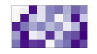|

### Reshaping（重塑）

| Code | Result | | Code | Result |
|:-:|:-:|:-:|:-:|:-:|
|`Z[2,2] = 1`|||`Z = Z.reshape(1,12)`|.png)|
|`Z = Z.reshape(4,3)`|.png)||`Z = Z.reshape(12,1)`|.png)|
|`Z = Z.reshape(6,2)`|.png)||`Z = Z.reshape(2,6)`|.png)|

### Slicing（切片）

| Code | Result | | Code | Result |
|:-:|:-:|:-:|:-:|:-:|
|`Z`|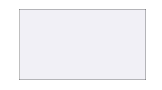||`Z[...] = 1`||
|`Z[1,1] = 1`|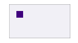||`Z[:,0] = 1`||
|`Z[0,:] = 1`|||`Z[2:,2:] = 1`||
|`Z[:,::2] = 1`|||`Z[::2,:] = 1`||
|`Z[:-2,:-2] = 1`|||`Z[2:4,2:4] = 1`||
|`Z[::2,::2] = 1`|||`Z[3::2,3::2] = 1`||

### Broadcasting（广播）

| | | | | | | | | |
|:-:|:-:|:-:|:-:|:-:|:-:|:-:|:-:|:-:|
|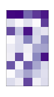|**+**||**→**||**+**||**=**||
||**+**||**→**||**+**||**=**||
||**+**||**→**||**+**|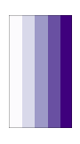|**=**||
||**+**||**→**||**+**||**=**|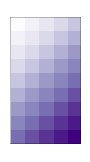|

### Operations（操作）

| Code | Before | After |
|:-:|:-:|:-:|
|`Z = np.where(Z > 0.5, 0, 1)`|||
|`Z = np.maximum(Z, 0.5)`|||
|`Z = np.minimum(Z, 0.5)`|||
|`Z = np.sum(Z, axis=0)`|||